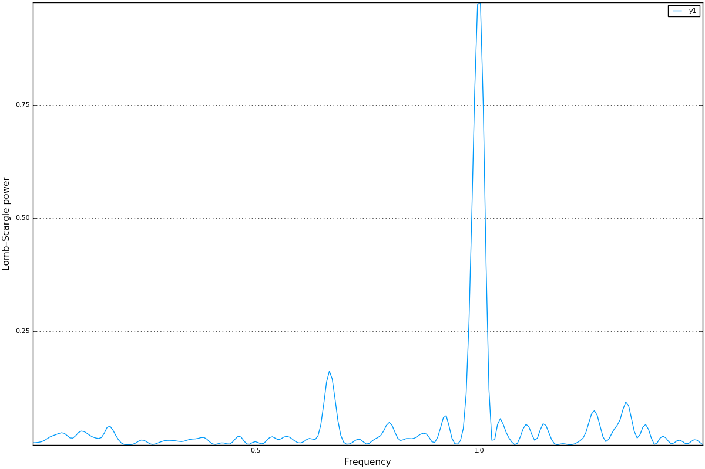

LombScargle.jl
==============

Introduction
------------

`LombScargle.jl <https://github.com/giordano/LombScargle.jl>`__ is a package for
a fast multi-threaded estimation of the `frequency spectrum
<https://en.wikipedia.org/wiki/Frequency_spectrum>`__ of a periodic signal with
`the Lomb–Scargle periodogram
<https://en.wikipedia.org/wiki/The_Lomb–Scargle_periodogram>`__.  This is
written in `Julia <http://julialang.org/>`__, a modern high-level,
high-performance dynamic programming language designed for technical computing.

Another Julia package that provides tools to perform spectral analysis of
signals is `DSP.jl <https://github.com/JuliaDSP/DSP.jl>`__, but its methods
require that the signal has been sampled at equally spaced times.  Instead, the
Lomb–Scargle periodogram enables you to analyze unevenly sampled data as well,
which is a fairly common case in astronomy, a field where this periodogram is
widely used.

The algorithms used in this package are reported in the following papers:

.. [PR89] Press, W. H., Rybicki, G. B. 1989, ApJ, 338, 277 (URL:
	  http://dx.doi.org/10.1086/167197, Bibcode:
	  http://adsabs.harvard.edu/abs/1989ApJ...338..277P)
.. [TOW10] Townsend, R. H. D. 2010, ApJS, 191, 247 (URL:
	   http://dx.doi.org/10.1088/0067-0049/191/2/247, Bibcode:
	   http://adsabs.harvard.edu/abs/2010ApJS..191..247T)
.. [ZK09] Zechmeister, M., Kürster, M. 2009, A&A, 496, 577 (URL:
	  http://dx.doi.org/10.1051/0004-6361:200811296, Bibcode:
	  http://adsabs.harvard.edu/abs/2009A%26A...496..577Z)

Othe relevant papers are:

.. [CMB99] Cumming, A., Marcy, G. W., & Butler, R. P. 1999, ApJ, 526, 890 (URL:
	   http://dx.doi.org/10.1086/308020, Bibcode:
	   http://adsabs.harvard.edu/abs/1999ApJ...526..890C)
.. [CUM04] Cumming, A. 2004, MNRAS, 354, 1165 (URL:
	   http://dx.doi.org/10.1111/j.1365-2966.2004.08275.x, Bibcode:
	   http://adsabs.harvard.edu/abs/2004MNRAS.354.1165C)
.. [HB86] Horne, J. H., & Baliunas, S. L. 1986, ApJ, 302, 757 (URL:
	  http://dx.doi.org/10.1086/164037, Bibcode:
	  http://adsabs.harvard.edu/abs/1986ApJ...302..757H)
.. [LOM76] Lomb, N. R. 1976, Ap&SS, 39, 447 (URL:
	   http://dx.doi.org/10.1007/BF00648343, Bibcode:
	   http://adsabs.harvard.edu/abs/1976Ap%26SS..39..447L)
.. [MHC93] Murdoch, K. A., Hearnshaw, J. B., & Clark, M. 1993, ApJ, 413, 349
	   (URL: http://dx.doi.org/10.1086/173003, Bibcode:
	   http://adsabs.harvard.edu/abs/1993ApJ...413..349M)
.. [SCA82] Scargle, J. D. 1982, ApJ, 263, 835 (URL:
	   http://dx.doi.org/10.1086/160554, Bibcode:
	   http://adsabs.harvard.edu/abs/1982ApJ...263..835S)
.. [SS10] Sturrock, P. A., & Scargle, J. D. 2010, ApJ, 718, 527 (URL:
	  http://dx.doi.org/10.1088/0004-637X/718/1/527, Bibcode:
	  http://adsabs.harvard.edu/abs/2010ApJ...718..527S)

The package provides facilities to:

* compute the periodogram using different methods (with different speeds) and
  different normalizations.  This is one of the fastest implementations of these
  methods available as free software.  If Julia is run with more than one
  `thread
  <http://docs.julialang.org/en/stable/manual/parallel-computing/#multi-threading-experimental>`_,
  computation is automatically multi-threaded, further speeding up calculations;
* access the frequency and period grid of the resulting periodogram, together
  with the power spectrum;
* find the maximum power in the periodogram and the frequency and period
  corresponding to the peak.  All these queries can be restricted to a specified
  region, in order to search a local maximum, instead of the global one;
* calculate the probability that a peak arises from noise only (false-alarm
  probability) using analytic formulas, in order to assess the significance of
  the peak;
* perform bootstrap resamplings in order to compute the false-alarm probability
  with a statistical method;
* determine the best-fitting Lomb–Scargle model for the given data set at the
  given frequency.

Installation
------------

``LombScargle.jl`` is available for Julia 0.6 and later versions, and can be
installed with `Julia built-in package manager
<http://docs.julialang.org/en/stable/manual/packages/>`__.  In a Julia session
run the commands

.. code-block:: julia

    julia> Pkg.update()
    julia> Pkg.add("LombScargle")

Older versions are also available for Julia 0.4 and 0.5.

Usage
-----

After installing the package, you can start using it with

.. code-block:: julia

    using LombScargle

The module defines a new ``LombScargle.Periodogram`` data type, which, however,
is not exported because you will most probably not need to directly manipulate
such objects.  This data type holds both the frequency and the power vectors of
the periodogram.

The main function provided by the package is ``lombscargle``:

.. function:: lombscargle(times::AbstractVector{Real}, signal::AbstractVector{Real})

which returns a ``LombScargle.Periodogram``.  The only two mandatory arguments
are:

-  ``times``: the vector of observation times
-  ``signal``: the vector of observations associated with ``times``

All these vectors must have the same length.

.. Tip::

   You can pre-plan a periodogram with :func:`LombScargle.plan` function, which
   has the same syntax as :func:`lombscargle` described in this section.  In
   this way the actual computation of the periodogram is faster and you will
   save memory.  See the `Planning the Periodogram`_ section below.

Besides the two arguments introduced above, :func:`lombscargle` has a number of
other optional arguments and keywords in order to choose the right algorithm to
use and tweak the appearance of the periodogram (do not be scared, you will most
probably need to use only a few of them, see the Examples_ section).  Here is
the complete syntax:

.. code-block:: julia

    lombscargle(times::AbstractVector{Real},
                signal::AbstractVector{Real},
                errors::AbstractVector{Real}=ones(signal);
                normalization::Symbol=:standard,
                noise_level::Real=1.0,
                center_data::Bool=true,
                fit_mean::Bool=true,
                fast::Bool=true,
		flags::Integer=FFTW.ESTIMATE,
		timelimit::Real=Inf,
                oversampling::Integer=5,
                Mfft::Integer=4,
                samples_per_peak::Integer=5,
                nyquist_factor::Integer=5,
                minimum_frequency::Real=NaN,
                maximum_frequency::Real=NaN,
                frequencies::AbstractVector{Real}=
                autofrequency(times,
                              samples_per_peak=samples_per_peak,
                              nyquist_factor=nyquist_factor,
                              minimum_frequency=minimum_frequency,
                              maximum_frequency=maximum_frequency))

The only optional argument is:

- ``errors``: the uncertainties associated to each ``signal`` point.  This
  vector must have the same length as ``times`` and ``signal``.

Besides the two arguments introduced above, `lombscargle` has a number of other
optional keywords in order to choose the right algorithm to use and tweak the
periodogram (do not be scared by their number, you will most probably need to
use sometimesonly a few of them, see the Examples_ section).  Optional keyword
arguments are:

- ``normalization``: how to normalize the periodogram.  Valid choices are:
  ``:standard``, ``:model``, ``:log``, ``:psd``, ``:Scargle``,
  ``:HorneBaliunas``, ``:Cumming``.  See Normalization_ section for details
- ``noise_level``: the noise level used to normalize the periodogram when
  ``normalization`` is set to ``:Scargle``
- ``fit_mean``: if ``true``, fit for the mean of the signal using the
  Generalised Lomb–Scargle algorithm (see [ZK09]_).  If this is ``false`` and no
  uncertainty on the signal is provided, the original algorithm by Lomb and
  Scargle will be employed (see [TOW10]_)
- ``center_data``: if ``true``, subtract the weighted mean of ``signal`` from
  ``signal`` itself before performing the periodogram.  This is especially
  important if ``fit_mean`` is ``false``
- ``frequencies``: the frequecy grid (not angular frequencies) at which the
  periodogram will be computed, as a vector. If not provided, it is
  automatically determined with ``LombScargle.autofrequency`` function, which
  see. See below for other available keywords that can be used to adjust the
  frequency grid without directly setting ``frequencies``

In addition, you can use all optional keyword arguments of
``LombScargle.autofrequency`` function in order to tune the
``frequencies`` vector without calling the function:

-  ``samples_per_peak``: the approximate number of desired samples
   across the typical peak
-  ``nyquist_factor``: the multiple of the average Nyquist frequency
   used to choose the maximum frequency if ``maximum_frequency`` is not
   provided
-  ``minimum_frequency``: if specified, then use this minimum frequency
   rather than one chosen based on the size of the baseline
-  ``maximum_frequency``: if specified, then use this maximum frequency
   rather than one chosen based on the average Nyquist frequency

The frequency grid is determined by following prescriptions given at
https://jakevdp.github.io/blog/2015/06/13/lomb-scargle-in-python/ and
uses the same keywords names adopted in Astropy.

The keywords ``fast``, ``flags``, ``timelimit``, ``oversampling``, and ``Mfft``
are described in the `Fast Algorithm`_ section below.

.. Tip::

   ``LombScargle.jl`` exploits Julia’s native `multi-threading
   <http://docs.julialang.org/en/stable/manual/parallel-computing/#multi-threading-experimental>`_
   for the non-fast methods (the methods used when you set the keyword
   ``fast=false``).  Run Julia with :math:`n` threads (e.g.,
   ``JULIA_NUM_THREADS=4 julia`` for 4 threads, if your machine has 4 physical
   cores) in order to automatically gain an :math:`n` -fold scaling.

   Please note that multi-threading is still an experimental feature in Julia,
   so you may encounter issues when running it with more than one thread.  For
   example, bug `#17395 <https://github.com/JuliaLang/julia/issues/17395>`__ (if
   still open) may prevent the function, on some systems, from effectively
   scaling.

If the signal has uncertainties, the ``signal`` vector can also be a vector of
``Measurement`` objects (from `Measurements.jl
<https://github.com/giordano/Measurements.jl>`__ package), in which case you
need not to pass a separate ``errors`` vector for the uncertainties of the
signal. You can create arrays of ``Measurement`` objects with the
``measurement`` function, see ``Measurements.jl`` manual at
http://measurementsjl.readthedocs.io/ for more details.  The generalised
Lomb–Scargle periodogram by [ZK09]_ is always used when the signal has
uncertainties, because the original Lomb–Scargle algorithm cannot handle them.

.. Tip::

   The uncertainties are only used in the generalised Lomb–Scargle algorithm to
   build an `inverse-variance
   <https://en.wikipedia.org/wiki/Inverse-variance_weighting>`_ weights vector
   (see [ZK09]_), that gives more importance to datapoints with lower
   uncertainties.  The case where all measurements have the same uncertainty (a
   condition known as `homoskedasticity
   <https://en.wikipedia.org/wiki/Homoscedasticity>`_) results in a costant
   weights vector, like if there are no uncertainties at all.  If you have
   homoskedastic errors, you do not need to provide them to :func:`lombscargle`.

Fast Algorithm
~~~~~~~~~~~~~~

When the frequency grid is evenly spaced, you can compute an approximate
generalised Lomb–Scargle periodogram using a fast algorithm proposed by [PR89]_
that greatly speeds up calculations, as it scales as :math:`O[N \log(M)]` for
:math:`N` data points and :math:`M` frequencies.  For comparison, the true
Lomb–Scargle periodogram has complexity :math:`O[NM]`.  The larger the number of
datapoints, the more accurate the approximation.

.. Note::

   This method internally performs a `Fast Fourier Transform
   <https://en.wikipedia.org/wiki/Fast_Fourier_transform>`_ (FFT) to compute
   some quantities, but it is in no way equivalento to conventional Fourier
   periodogram analysis.

   ``LombScargle.jl`` uses `FFTW <http://fftw.org/>`_ functions to compute the
   FFT.  You can speed-up this task by using multi-threading: call
   ``FFTW.set_num_threads(n)`` to use :math:`n` threads.  However, please note
   that the running time will not scale as :math:`n` because computation of the
   FFT is only a part of the algorithm.

The only prerequisite in order to be able to employ this fast method is to
provide a ``frequencies`` vector as a ``Range`` object, which ensures that the
frequency grid is perfectly evenly spaced.  This is the default, since
``LombScargle.autofrequency`` returns a ``Range`` object.

.. Tip::

   In Julia, a ``Range`` object can be constructed for example with the
   `linspace
   <http://docs.julialang.org/en/stable/stdlib/arrays/#Base.linspace>`_ function
   (you specify the start and the end of the range, and optionally the length of
   the vector) or with the syntax `start:stop
   <http://docs.julialang.org/en/stable/stdlib/math/#Base.:>`_ (you specify the
   start and the end of the range, and optionally the linear step; a related
   function is `colon
   <http://docs.julialang.org/en/stable/stdlib/math/#Base.colon>`_).  Somewhere
   in the middle is the `range
   <http://docs.julialang.org/en/stable/stdlib/math/#Base.range>`_ function: you
   specify the start of the range and the length of the vector, and optionally
   the linear step.

Since this fast method is accurate only for large datasets, it is enabled by
default only if the number of output frequencies is larger than 200.  You can
override the default choice of using this method by setting the ``fast`` keyword
to ``true`` or ``false``.  We recall that in any case, the ``frequencies``
vector must be a ``Range`` in order to use this method.

To summarize, provided that ``frequencies`` vector is a ``Range`` object, you
can use the fast method:

* by default if the length of the output frequency grid is larger than 200
  points
* in any case with the ``fast=true`` keyword

Setting ``fast=false`` always ensures you that this method will not be used,
instead ``fast=true`` actually enables it only if ``frequencies`` is a
``Range``.

The integer keywords ``flags``, ``timelimit``, ``ovesampling``, and ``Mfft`` can
be passed to :func:`lombscargle` and :func:`LombScargle.plan` in order to affect
the computation in the fast method:

* ``flags``: bitwise-or of FFTW planner flags, defaulting to ``FFTW.ESTIMATE``.
  Passing ``FFTW.MEASURE`` or ``FFTW.PATIENT`` will instead spend several
  seconds (or more) benchmarking different possible FFT algorithms and picking
  the fastest one; see the FFTW manual for more information on planner flags.
* ``timelimit``: specifies a rough upper bound on the allowed planning time, in
  seconds.
* ``oversampling``: oversampling the frequency factor for the approximation;
  roughly the number of time samples across the highest-frequency sinusoid.
  This parameter contains the tradeoff between accuracy and speed.
* ``Mfft``: the number of adjacent points to use in the FFT approximation.

Planning the Periodogram
~~~~~~~~~~~~~~~~~~~~~~~~

In a manner similar to planning Fourier transforms with FFTW, it is possible to
speed-up computation of the Lomb–Scargle periodogram by pre-planning it with
``LombScargle.plan`` function.  It has the same syntax as :func:`lombscargle`,
which in the base case is:

.. function:: LombScargle.plan(times::AbstractVector{Real}, signal::AbstractVector{Real})

It takes all the same argument as :func:`lombscargle` shown above and returns a
``LombScargle.PeriodogramPlan`` object after having pre-computed certain
quantities needed afterwards, and pre-allocated the memory for the periodogram.
It is highly suggested to plan a periodogram before actually computing it,
especially for the fast method.  Once you plan a periodogram, you can pass the
``LombScargle.PeriodogramPlan`` to :func:`lombscargle` as the only argument.

Planning the periodogram has a twofold advantage.  First of all, the planning
stage is `type-unstable
<https://docs.julialang.org/en/latest/manual/performance-tips.html>`__, because
the type of the plan depends on the value of input parameters, and not on their
types.  Thus, separating the planning (inherently inefficient) from the actual
computation of the periodogram (completely type-stable) makes overall
computation faster than directly calling :func:`lombscargle`.  Secondly, the
``LombScargle.PeriodogramPlan`` bears the time vector, but the quantities that
are pre-computed in planning stage do not actually depend on it.  This is
particularly useful if you want to calculate the false-alarm probability via
bootstrapping with :func:`LombScargle.bootstrap` function: the vector time is
randomly shuffled, but pre-computed quantities will remain the same, saving both
time and memory in each iteration.  In addition, you ensure that you will use
the same options you used to compute the periodogram.

Normalization
~~~~~~~~~~~~~

By default, the periodogram :math:`p(f)` is normalized so that it has values in
the range :math:`0 \leq p(f) \leq 1`, with :math:`p = 0` indicating no
improvement of the fit and :math:`p = 1` a "perfect" fit (100% reduction of
:math:`\chi^2` or :math:`\chi^2 = 0`).  This is the normalization suggested by
[LOM76]_ and [ZK09]_, and corresponds to the ``:standard`` normalization in
:func:`lombscargle` function.  [ZK09]_ wrote the formula for the power of the
periodogram at frequency :math:`f` as

.. math:: p(f) = \frac{1}{YY}\left[\frac{YC^2_{\tau}}{CC_{\tau}} + \frac{YS^2_{\tau}}{SS_{\tau}}\right]

See the paper for details.  The other normalizations for periodograms
:math:`P(f)` are calculated from this one.  In what follows, :math:`N` is the
number of observations.

- ``:model``:

  .. math::
     P(f) = \frac{p(f)}{1 - p(f)}

- ``:log``:

  .. math::
     P(f) = -\log(1 - p(f))

- ``:psd``:

  .. math::
     P(f) = \frac{1}{2}\left[\frac{YC^2_{\tau}}{CC_{\tau}} +
            \frac{YS^2_{\tau}}{SS_{\tau}}\right] = p(f) \frac{YY}{2}

- ``:Scargle``:

  .. math::
     P(f) = \frac{p(f)}{\text{noise level}}

  This normalization can be used when you know the noise level (expected from
  the a priori known noise variance or population variance), but this isn’t
  usually the case.  See [SCA82]_
- ``:HorneBaliunas``:

  .. math::
     P(f) = \frac{N - 1}{2} p(f)

  This is like the ``:Scargle`` normalization, where the noise has been
  estimated for Gaussian noise to be :math:`(N - 1)/2`.  See [HB86]_
- If the data contains a signal or if errors are under- or overestimated or if
  intrinsic variability is present, then :math:`(N-1)/2` may not be a good
  uncorrelated estimator for the noise level.  [CMB99]_ suggested to estimate
  the noise level a posteriori with the residuals of the best fit and normalised
  the periodogram as:

  .. math::
     P(f) = \frac{N - 3}{2} \frac{p(f)}{1 - p(f_{\text{best}})}

  This is the ``:Cumming`` normalization option

Access Frequency Grid and Power Spectrum of the Periodogram
~~~~~~~~~~~~~~~~~~~~~~~~~~~~~~~~~~~~~~~~~~~~~~~~~~~~~~~~~~~

.. function:: power(p::Periodogram)
.. function:: freq(p::Periodogram)
.. function:: freqpower(p::Periodogram)

:func:`lombscargle` function return a ``LombScargle.Periodogram`` object, but
you most probably want to use the frequency grid and the power spectrum. You can
access these vectors with ``freq`` and ``power`` functions, just like in
``DSP.jl`` package. If you want to get the 2-tuple ``(freq(p), power(p))`` use
the ``freqpower`` function.

Access Periods and their and Power in the Periodogram
~~~~~~~~~~~~~~~~~~~~~~~~~~~~~~~~~~~~~~~~~~~~~~~~~~~~~

.. function:: period(p::Periodogram)
.. function:: periodpower(p::Periodogram)

These utilities are the analogs of :func:`freq` and :func:`freqpower`, but
relative to the periods instead of the frequencies.  Thus ``period(p)`` returns
the vector of periods in the periodogram, that is ``1./freq(p)``, and
``periodpower(p)`` gives you the 2-tuple ``(period(p), power(p))``.

``findmaxpower``, ``findmaxfreq``, and ``findmaxperiod`` Functions
~~~~~~~~~~~~~~~~~~~~~~~~~~~~~~~~~~~~~~~~~~~~~~~~~~~~~~~~~~~~~~~~~~

.. function:: findmaxpower(p::Periodogram)
.. function:: findmaxfreq(p::Periodogram, [interval::AbstractVector{Real}], threshold::Real=findmaxpower(p))
.. function:: findmaxperiod(p::Periodogram, [interval::AbstractVector{Real}], threshold::Real=findmaxpower(p))

Once you compute the periodogram, you usually want to know which are the
frequencies or periods with highest power.  To do this, you can use the
:func:`findmaxfreq` and :func:`findmaxperiod` functions.  They return the vector
of frequencies and periods, respectively, with the highest power in the
periodogram ``p``.  If a scalar real argument ``threshold`` is provided, return
the frequencies with power larger than or equal to ``threshold``.  If you want
to limit the search to a narrower frequency or period range, pass as second
argument a vector with the extrema of the interval.

The value of the highest power of a periodogram can be calculated with the
:func:`findmaxpower` function.

False-Alarm Probability
~~~~~~~~~~~~~~~~~~~~~~~

.. function:: prob(P::Periodogram, power::Real)
.. function:: probinv(P::Periodogram, prob::Real)
.. function:: fap(P::Periodogram, power::Real)
.. function:: fapinv(P::Periodogram, fap::Real)

Noise in the data produce fluctuations in the periodogram that will present
several local peaks, but not all of them related to real periodicities.  The
significance of the peaks can be tested by calculating the probability that its
power can arise purely from noise.  The higher the value of the power, the lower
will be this probability.

.. Note::

   [CMB99]_ showed that the different normalizations result in different
   probability functions.  ``LombScargle.jl`` can calculate the probability (and
   the false-alarm probability) only for the normalizations reported by [ZK09]_,
   that are ``:standard``, ``:Scargle``, ``:HorneBaliunas``, and ``:Cumming``.

The probability :math:`\text{Prob}(p > p_{0})` that the periodogram power
:math:`p` can exceed the value :math:`p_{0}` can be calculated with the
:func:`prob` function, whose first argument is the periodogram and the second
one is the :math:`p_{0}` value.  The function :func:`probinv` is its inverse: it
takes the probability as second argument and returns the corresponding
:math:`p_{0}` value.

Here are the probability functions for each normalization supported by
``LombScargle.jl``:

- ``:standard`` (:math:`p \in [0, 1]`):

  .. math::
     \text{Prob}(p > p_{0}) = (1 - p_{0})^{(N - 3)/2}

- ``:Scargle`` (:math:`p \in [0, \infty)`):

  .. math::
     \text{Prob}(p > p_{0}) = \exp(-p_{0})

- ``:HorneBaliunas`` (:math:`p \in [0, (N - 1)/2]`):

  .. math::
     \text{Prob}(p > p_{0}) = \left(1 - \frac{2p_{0}}{N - 1}\right)^{(N - 3)/2}

- ``:Cumming`` (:math:`p \in [0, \infty)`):

  .. math::
     \text{Prob}(p > p_{0}) = \left(1 + \frac{2p_{0}}{N - 3}\right)^{-(N - 3)/2}

As explained by [SS10]_, «the term "false-alarm probability" denotes the
probability that at least one out of :math:`M` independent power values in a
prescribed search band of a power spectrum computed from a white-noise time
series is expected to be as large as or larger than a given value».
``LombScargle.jl`` provides the :func:`fap` function to calculate the
false-alarm probability (FAP) of a given power in a periodogram.  Its first
argument is the periodogram, the second one is the value :math:`p_{0}` of the
power of which you want to calculate the FAP.  The function :func:`fap` uses the
formula

.. math::
   \text{FAP} = 1 - (1 - \text{Prob}(p > p_{0}))^M

where :math:`M` is the number of independent frequencies estimated with :math:`M
= T \cdot \Delta f`, being :math:`T` the duration of the observations and
:math:`\Delta f` the width of the frequency range in which the periodogram has
been calculated (see [CUM04]_).  The function :func:`fapinv` is the inverse of
:func:`fap`: it takes as second argument the value of the FAP and returns the
corresponding value :math:`p_{0}` of the power.

The detection threshold :math:`p_{0}` is the periodogram power corresponding to
some (small) value of :math:`\text{FAP}`, i.e. the value of :math:`p` exceeded
due to noise alone in only a small fraction :math:`\text{FAP}` of trials.  An
observed power larger than :math:`p_{0}` indicates that a signal is likely
present (see [CUM04]_).

.. Caution::

   Some authors stressed that this method to calculate the false-alarm
   probability is not completely reliable.  A different approach to calculate
   the false-alarm probability is to perform Monte Carlo or bootstrap
   simulations in order to determine how often a certain power level
   :math:`p_{0}` is exceeded just by chance (see [CMB99]_, [CUM04]_, and
   [ZK09]_).  See next section.

Bootstrapping
'''''''''''''

.. function:: LombScargle.bootstrap(N::Integer, t::AbstractVector{Real}, s::AbstractVector{Real}, ...)
.. function:: LombScargle.bootstrap(N::Integer, plan::LombScargle.PeriodogramPlan)
.. function:: fap(b::Bootstrap, power::Real)
.. function:: fapinv(b::Bootstrap, prob::Real)

One of the possible and most simple statistical methods that you can use to
measure the false-alarm probability and its inverse is `bootstrapping
<https://en.wikipedia.org/wiki/Bootstrapping_%28statistics%29>`__ (see section
4.2.2 of [MHC93]_).

.. Note::

   We emphasize that you can use this method only if you know your data points
   are `independent and identically distributed
   <https://en.wikipedia.org/wiki/Independent_and_identically_distributed_random_variables>`__,
   and they have `white uncorrelated noise
   <https://en.wikipedia.org/wiki/White_noise>`__.

The recipe of the bootstrap method is very simple to implement:

* repeat the Lomb–Scargle analysis a large number :math:`N` of times on the
  original data, but with the signal (and errors, if present) vector randomly
  shuffled.  As an alternative, shuffle only the time vector;
* out of all these simulations, store the powers of the highest peaks;
* in order to estimate the false-alarm probability of a given power, count how
  many times the highest peak of the simulations exceeds that power, as a
  fraction of :math:`N`.  If you instead want to find the inverse of the
  false-alarm probability :math:`\text{prob}`, looks for the
  :math:`N\cdot\text{prob}`-th element of the highest peaks vector sorted in
  descending order.

Remember to pass to :func:`lombscargle` function the same options, if any, you
used to compute the Lomb–Scargle periodogram before.

``LombScargle.jl`` provides simple methods to perform such analysis.  The
:func:`LombScargle.bootstrap` function allows you to create a bootstrap sample
with ``N`` permutations of the original data.  All the arguments after the first
one are passed around to :func:`lombscargle`.  The output is a
``LombScargle.Bootstrap`` object.

You can also pass to :func:`LombScargle.bootstrap` a pre-computed
``LombScargle.PeriodogramPlan`` as second argument (this method takes no other
argument nor keyword).  In this way you will be sure to use exactly the same
options you used before for computing the periodogram with the same periodogram
plan.

The false-alarm probability and its inverse can be calculated with :func:`fap`
and :func:`fapinv` functions respectively.  Their syntax is the same as the
methods introduced above, but with a ``LombScargle.Bootstrap`` object as first
argument, instead of the ``LombScargle.Periodogram`` one.

``LombScargle.model`` Function
~~~~~~~~~~~~~~~~~~~~~~~~~~~~~~

.. function:: LombScargle.model(times, signal, frequency)

For each frequency :math:`f` (and hence for the corresponding angular frequency
:math:`\omega = 2\pi f`) the Lomb–Scargle algorithm looks for the sinusoidal
function of the type

.. math::

   a_f\cos(\omega t) + b_f\sin(\omega t) + c_f

that best fits the data.  In the original Lomb–Scargle algorithm the offset
:math:`c` is null (see [LOM76]_).  In order to find the best-fitting
coefficients :math:`a_f`, :math:`b_f`, and :math:`c_f` for the given frequency
:math:`f`, without actually performing the periodogram, you can solve the linear
system :math:`\mathbf{A}x = \mathbf{y}`, where :math:`\mathbf{A}` is the matrix

.. math::

   \begin{bmatrix}
     \cos(\omega t) & \sin(\omega t) & 1
   \end{bmatrix} =
   \begin{bmatrix}
     \cos(\omega t_{1}) & \sin(\omega t_{1}) & 1      \\
     \vdots             & \vdots             & \vdots \\
     \cos(\omega t_{n}) & \sin(\omega t_{n}) & 1
   \end{bmatrix}

:math:`t = [t_1, \dots, t_n]^\text{T}` is the column vector of observation
times, :math:`x` is the column vector with the unknown coefficients

.. math::

   \begin{bmatrix}
     a_f \\
     b_f \\
     c_f
   \end{bmatrix}

and :math:`\textbf{y}` is the column vector of the signal.  The solution of the
matrix gives the wanted coefficients.

This is what the :func:`LombScargle.model` function does in order to return the
best fitting Lomb–Scargle model for the given signal at the given frequency.

Mandatory arguments are:

* ``times``: the observation times
* ``signal``: the signal, sampled at ``times`` (must have the same length as
  ``times``)
* ``frequency``: the frequency at which to calculate the model

The complete syntax of :func:`LombScargle.model` has additional arguments:

.. code-block:: julia

    LombScargle.model(times::AbstractVector{Real},
                      signal::AbstractVector{Real},
                      [errors::AbstractVector{Real},]
                      frequency::Real,
                      [times_fit::AbstractVector{Real}];
                      center_data::Bool=true,
                      fit_mean::Bool=true)

The optional arguments are:

* ``errors``: the vector of uncertainties of the signal.  If provided, it must
  have the same length as ``signal`` and ``times``, and be the third argument.
  Like for :func:`lombscargle`, if the signal has uncertainties, the ``signal``
  vector can also be a vector of ``Measurement`` objects, and this argument
  should be omitted
* ``times_fit``: the vector of times at which the model will be calculated.  It
  defaults to ``times``.  If provided, it must come after ``frequency``

Optional boolean keywords ``center_data`` and ``fit_mean`` have the same meaning
as in :func:`lombscargle` function:

* ``fit_mean``: whether to fit for the mean.  If this is ``false``, like in the
  original Lomb–Scargle periodogram, :math:`\mathbf{A}` does not have the third
  column of ones, :math:`c_f` is set to :math:`0` and the unknown vector to be
  determined becomes :math:`x = [a_f, b_f]^\text{T}`
* ``center_data``: whether the data should be pre-centered before solving the
  linear system.  This is particularly important if ``fit_mean=false``

Examples
--------

Here is an example of a noisy periodic signal (:math:`\sin(\pi t) +
1.5\cos(2\pi t)`) sampled at unevenly spaced times.

.. code-block:: julia

   julia> using LombScargle

   julia> ntimes = 1001
   1001

   julia> t = linspace(0.01, 10pi, ntimes) # Observation times
   0.01:0.03140592653589793:31.41592653589793

   julia> t += step(t)*rand(ntimes) # Randomize times

   julia> s = sinpi.(t) .+ 1.5cospi.(2t) .+ rand(ntimes) # The signal

   julia> plan = LombScargle.plan(t, s); # Pre-plan the periodogram

   julia> pgram = lombscargle(plan) # Compute the periodogram
   LombScargle.Periodogram{Float64,StepRangeLen{Float64,Base.TwicePrecision{Float64},Base.TwicePrecision{Float64}},Array{Float64,1}}([0.000472346, 0.000461633, 0.000440906, 0.000412717, 0.000383552, 0.000355828, 0.000289723, 0.000154585, 3.44734e-5, 5.94437e-7  …  3.15125e-5, 0.000487391, 0.0018939, 0.00367003, 0.00484181, 0.00495189, 0.00453233, 0.00480968, 0.00619657, 0.0074052], 0.003185690706734265:0.00637138141346853:79.72190993602499, [0.0295785, 0.0540516, 0.0780093, 0.122759, 0.15685, 0.192366, 0.206601, 0.252829, 0.265771, 0.315443  …  31.1512, 31.1758, 31.2195, 31.2342, 31.2752, 31.293, 31.3517, 31.3761, 31.4148, 31.4199], :standard)

You can plot the result, for example with `Plots
<https://github.com/tbreloff/Plots.jl>`__ package.  Use :func:`freqpower`
function to get the frequency grid and the power of the periodogram as a
2-tuple.

.. code-block:: julia

   using Plots
   plot(freqpower(pgram)...)

.. image:: freq-periodogram.png

You can also plot the power vs the period, instead of the frequency, with
:func:`periodpower`:

.. code-block:: julia

   using Plots
   plot(periodpower(pgram)...)

.. image:: period-periodogram.png

.. Caution::

   If you do not fit for the mean of the signal (``fit_mean=false`` keyword to
   :func:`lombscargle` function) without centering the data
   (``center_data=false``) you can get inaccurate results.  For example,
   spurious peaks at low frequencies can appear and the real peaks lose power:

   .. code-block:: julia

      plot(freqpower(lombscargle(t, s, fit_mean=false, center_data=false))...)

   .. image:: figure_2.png

.. Tip::

   You can tune the frequency grid with appropriate keywords to
   :func:`lombscargle` function.  For example, in order to increase the sampling
   increase ``samples_per_peak``, and set ``maximum_frequency`` to lower values
   in order to narrow the frequency range:

   .. code-block:: julia

      plot(freqpower(lombscargle(t, s, samples_per_peak=20, maximum_frequency=1.5))...)

   .. image:: figure_3.png

   If you simply want to use your own frequency grid, directly set the
   ``frequencies`` keyword:

   .. code-block:: julia

      plot(freqpower(lombscargle(t, s, frequencies=0.001:1e-3:1.5))...)

   .. image:: figure_4.png

Signal with Uncertainties
~~~~~~~~~~~~~~~~~~~~~~~~~

The generalised Lomb–Scargle periodogram is able to handle a signal with
uncertainties, and they will be used as weights in the algorithm.  The
uncertainties can be passed either as the third optional argument ``errors`` to
:func:`lombscargle` or by providing this function with a ``signal`` vector of
type ``Measurement`` (from `Measurements.jl
<https://github.com/giordano/Measurements.jl>`__ package).

.. code-block:: julia

    using Measurements, Plots
    ntimes = 1001
    t = linspace(0.01, 10pi, ntimes)
    s = sinpi.(2t)
    errors = rand(0.1:1e-3:4.0, ntimes)
    # Run one of the two following equivalent commands
    plot(freqpower(lombscargle(t, s, errors, maximum_frequency=1.5))...)
    plot(freqpower(lombscargle(t, measurement(s, errors), maximum_frequency=1.5))...)

This is the plot of the power versus the period:

.. code-block:: julia

    # Run one of the two following equivalent commands
    plot(periodpower(lombscargle(t, s, errors, maximum_frequency=1.5))...)
    plot(periodpower(lombscargle(t, measurement(s, errors), maximum_frequency=1.5))...)

.. image:: period-uncertainties.png

We recall that the generalised Lomb–Scargle algorithm is used when the
``fit_mean`` optional keyword to :func:`lombscargle` is ``true`` if no error is
provided, instead it is always used if the signal has uncertainties.

Find Highest Power and Associated Frequencies and Periods
~~~~~~~~~~~~~~~~~~~~~~~~~~~~~~~~~~~~~~~~~~~~~~~~~~~~~~~~~

:func:`findmaxfreq` function tells you the frequencies with the highest power in
the periodogram (and you can get the period by taking its inverse):

.. code-block:: julia

   julia> t = linspace(0, 10, 1001)

   julia> s = sinpi.(t)

   julia> plan = LombScargle.plan(t, s); # Plan the periodogram

   julia> p = lombscargle(plan)

   julia> findmaxperiod(p) # Period with highest power
   1-element Array{Float64,1}:
    0.00498778

   julia> findmaxfreq(p) # Frequency with the highest power
   1-element Array{Float64,1}:
    200.49

This peak is at high frequencies, very far from the expected value of the period
of 2.  In order to find the real peak, you can either narrow the ranges in order
to exclude higher armonics

.. code-block:: julia

   julia> findmaxperiod(p, [1, 10]) # Limit the search to periods in [1, 10]
   1-element Array{Float64,1}:
    2.04082

   julia> findmaxfreq(p, [0.1, 1]) # Limit the search to frequencies in [0.1, 1]
   1-element Array{Float64,1}:
    0.49

or pass the ``threshold`` argument to :func:`findmaxfreq` or
:func:`findmaxperiod`.  You can use :func:`findmaxpower` to discover the highest
power in the periodogram:

.. code-block:: julia

   julia> findmaxpower(p)
   0.9958310178312316

   julia> findmaxperiod(p, 0.95)
   10-element Array{Float64,1}:
    2.04082
    1.96078
    0.0100513
    0.0100492
    0.00995124
    0.00994926
    0.00501278
    0.00501228
    0.00498778
    0.00498728

   julia> findmaxfreq(p, 0.95)
   10-element Array{Float64,1}:
      0.49
      0.51
     99.49
     99.51
    100.49
    100.51
    199.49
    199.51
    200.49
    200.51

The first peak is the real one, the other double peaks appear at higher
armonics.

.. Tip::

   Usually, plotting the periodogram can give you a clue of what’s going on.

Significance of the Peaks
~~~~~~~~~~~~~~~~~~~~~~~~~

The significance of the peaks in the Lomb–Scargle periodogram can be assessed by
measuring the `False-Alarm Probability`_.  Analytic expressions of this quantity
and its inverse can be obtained with the :func:`fap` and :func:`fapinv`
functions, respectively.

.. code-block:: julia

   julia> t = linspace(0.01, 20, samples_per_peak = 10)

   julia> s = sinpi.(e.*t).^2 .- cos.(5t).^4

   julia> plan = LombScargle.plan(t, s);

   julia> p = lombscargle(plan)

   # Find the false-alarm probability for the highest peak.
   julia> fap(p, 0.3)
   0.028198095962262748

Thus, a peak with power :math:`0.3` has a probability of :math:`0.028` that it
is due to noise only.  A quantity that is often used is the inverse of the
false-alarm probability as well: what is the minimum power whose false-alarm
probability is lower than the given probability?  For example, if you want to
know the minimum power for which the false-alarm probability is at most
:math:`0.01` you can use:

.. code-block:: julia

   julia> fapinv(p, 0.01)
   0.3304696923786712

As we already noted, analytic expressions of the false-alarm probability and its
inverse may not be reliable if your data does not satisfy specific assumptions.
A better way to calculate this quantity is to use statistical methods.  One of
this is bootstrapping.  In ``LombScargle.jl``, you can use the function
:func:`LombScargle.bootstrap` to create a bootstrap sample and then you can
calculate the false-alarm probability and its inverse using this sample.

.. Tip::

   When applying the bootstrap method you should use the same options you used
   to perform the periodogram on your data.  Using the same periodogram plan you
   used to compute the periodogram will ensure that you use the same options.
   However, note that the fast method gives approximate results that for some
   frequencies may not be reliable (they can go outside the range :math:`[0, 1]`
   for the standard normalization).  More robust results can be obtained with
   the ``fast = false`` option.

.. code-block:: julia

   # Create a bootstrap sample with 10000
   # resamplings of the original data, re-using the
   # same periodogram plan.  The larger the better.
   # This may take some minutes.
   julia> b = LombScargle.bootstrap(10000, plan)

   # Calculate the false-alarm probability of a peak
   # with power 0.3 using this bootstrap sample.
   julia> fap(b, 0.3)
   0.0209

   # Calculate the lowest power that has probability
   # less than 0.01 in this bootstrap sample.
   julia> fapinv(b, 0.01)
   0.3268290388848437

If you query :func:`fapinv` with a too low probability, the corresponding power
cannot be determined and you will get ``NaN`` as result.

.. code-block:: julia

   julia> fapinv(b, 1e-5)
   NaN

If you want to find the power corresponding to a false-alarm probability of
:math:`\text{prob} = 10^{-5}`, you have to create a new bootstrap sample with
:math:`N` resamplings so that :math:`N\cdot\text{prob}` can be rounded to an
integer larger than or equal to one (for example :math:`N = 10^{5}`).

Find the Best-Fitting Model
~~~~~~~~~~~~~~~~~~~~~~~~~~~

The :func:`LombScargle.model` function can help you to test whether a certain
frequency fits well your data.

.. code-block:: julia

    using Plots
    t = linspace(0.01, 10pi, 1000) # Observation times
    s = sinpi.(t) .+ 1.2cospi.(t) .+ 0.3rand(length(t)) # The noisy signal
    # Pick-up the best frequency
    f = findmaxfreq(lombscargle(t, s, maximum_frequency=10, samples_per_peak=20))[1]
    t_fit = linspace(0, 1)
    s_fit = LombScargle.model(t, s, f, t_fit/f) # Determine the model
    scatter(mod.(t.*f, 1), s, lab="Phased data", title="Best Lomb-Scargle frequency: $f")
    plot!(t_fit, s_fit, lab="Best-fitting model", linewidth=4)

.. image:: figure_6.png

.. Tip::

   If there are more than one dominant frequency you may need to consider more
   models.  This task may require some work and patience.  Plot the periodogram
   in order to find the best frequencies.

   .. code-block:: julia

      using Plots
      t = linspace(0.01, 5, 1000) # Observation times
      s = sinpi.(2t) .+ 1.2cospi.(4t) .+ 0.3rand(length(t)) # Noisy signal
      plan = LombScargle.plan(t, s, samples_per_peak=50)
      p = lombscargle(plan)
      # After plotting the periodogram, you discover
      # that it has two prominent peaks around 1 and 2.
      f1 = findmaxfreq(p, [0.8, 1.2])[1] # Get peak frequency around 1
      f2 = findmaxfreq(p, [1.8, 2.2])[1] # Get peak frequency around 2
      fit1 = LombScargle.model(t, s, f1) # Determine the first model
      fit2 = LombScargle.model(t, s, f2) # Determine the second model
      scatter(t, s, lab="Data", title="Best-fitting Lomb-Scargle model")
      plot!(t, fit1 + fit2, lab="Best-fitting model", linewidth=4)

   .. image:: figure_7.png

Performance
-----------

A pre-planned periodogram in ``LombScargle.jl`` computed in single thread mode
with the fast method is more than 2.9 times faster than the implementation of
the same algorithm provided by AstroPy, and more than 4.5 times faster if 4 FFTW
threads are used (on machines with at least 4 physical CPUs).

The following plot shows a comparison between the times needed to compute a
periodogram for a signal with N datapoints using ``LombScargle.jl``, with 1 or 4
threads (with ``flags = FFTW.MEASURE`` for better performance), and the
single-threaded AstroPy implementation.  (Julia version: 0.7.0-DEV.2309, commit
7ae9955c93; `LombScargle.jl` version: 0.3.1; Python version: 3.5.4; Astropy
version: 2.0.2.  CPU: Intel(R) Core(TM) i7-4700MQ.)

.. image:: ../perf/benchmarks.*

Note that this comparison is unfair, as AstroPy doesn’t support pre-planning a
periodogram nor exploiting multi-threading.  A non-planned periodogram in single
thread mode in ``LombScargle.jl`` is still twice faster than AstroPy.

Development
-----------

The package is developed at https://github.com/giordano/LombScargle.jl.
There you can submit bug reports, make suggestions, and propose pull
requests.

History
~~~~~~~

The ChangeLog of the package is available in
`NEWS.md <https://github.com/giordano/LombScargle.jl/blob/master/NEWS.md>`__
file in top directory.

License
-------

The ``LombScargle.jl`` package is licensed under the BSD 3-clause "New" or
"Revised" License. The original author is Mosè Giordano.

Acknowledgements
~~~~~~~~~~~~~~~~

This package adapts the implementation in Astropy of the the fast Lomb–Scargle
method by [PR89]_.  We claim no endorsement nor promotion by the Astropy Team.
