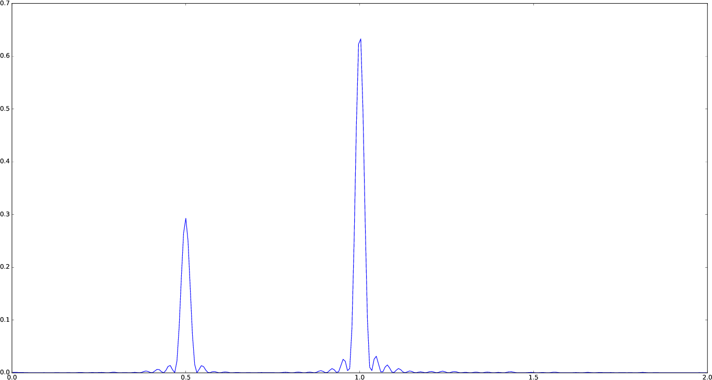
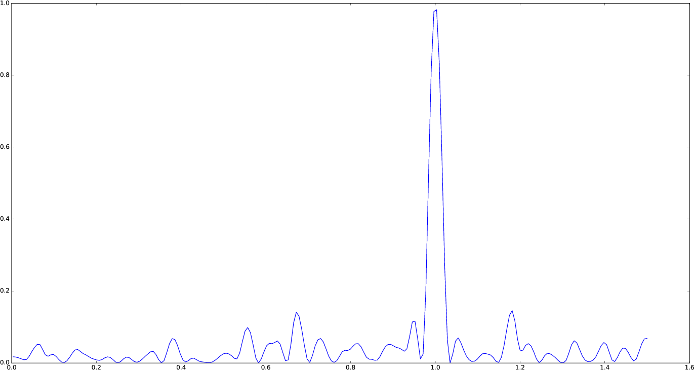

LombScargle.jl
==============

Introduction
------------

`LombScargle.jl <https://github.com/giordano/LombScargle.jl>`__ is a `Julia
<http://julialang.org/>`__ package to estimate the `frequency spectrum
<https://en.wikipedia.org/wiki/Frequency_spectrum>`__ of a periodic signal with
`the Lomb–Scargle periodogram
<https://en.wikipedia.org/wiki/The_Lomb–Scargle_periodogram>`__.

Another Julia package that provides tools to perform spectral analysis of
signals is `DSP.jl <https://github.com/JuliaDSP/DSP.jl>`__, but its methods
require that the signal has been sampled at equally spaced times.  Instead, the
Lomb–Scargle periodogram enables you to analyze unevenly sampled data as well,
which is a fairly common case in astronomy, a field where this periodogram is
widely used.

The algorithms used in this package are reported in the following papers:

.. [PR89] Press, W. H., Rybicki, G. B. 1989, ApJ, 338, 277 (URL:
	  http://dx.doi.org/10.1086/167197, Bibcode:
	  http://adsabs.harvard.edu/abs/1989ApJ...338..277P)
.. [TOW10] Townsend, R. H. D. 2010, ApJS, 191, 247 (URL:
	   http://dx.doi.org/10.1088/0067-0049/191/2/247, Bibcode:
	   http://adsabs.harvard.edu/abs/2010ApJS..191..247T)
.. [ZK09] Zechmeister, M., Kürster, M. 2009, A&A, 496, 577 (URL:
	  http://dx.doi.org/10.1051/0004-6361:200811296, Bibcode:
	  http://adsabs.harvard.edu/abs/2009A%26A...496..577Z)

Othe relevant papers are:

.. [CMB99] Cumming, A., Marcy, G. W., & Butler, R. P. 1999, ApJ, 526, 890 (URL:
	   http://dx.doi.org/10.1086/308020, Bibcode:
	   http://adsabs.harvard.edu/abs/1999ApJ...526..890C)
.. [CUM04] Cumming, A. 2004, MNRAS, 354, 1165 (URL:
	   http://dx.doi.org/10.1111/j.1365-2966.2004.08275.x, Bibcode:
	   http://adsabs.harvard.edu/abs/2004MNRAS.354.1165C)
.. [HB86] Horne, J. H., & Baliunas, S. L. 1986, ApJ, 302, 757 (URL:
	  http://dx.doi.org/10.1086/164037, Bibcode:
	  http://adsabs.harvard.edu/abs/1986ApJ...302..757H)
.. [LOM76] Lomb, N. R. 1976, Ap&SS, 39, 447 (URL:
	   http://dx.doi.org/10.1007/BF00648343, Bibcode:
	   http://adsabs.harvard.edu/abs/1976Ap%26SS..39..447L)
.. [SCA82] Scargle, J. D. 1982, ApJ, 263, 835 (URL:
	   http://dx.doi.org/10.1086/160554, Bibcode:
	   http://adsabs.harvard.edu/abs/1982ApJ...263..835S)
.. [SS10] Sturrock, P. A., & Scargle, J. D. 2010, ApJ, 718, 527 (URL:
	  http://dx.doi.org/10.1088/0004-637X/718/1/527, Bibcode:
	  http://adsabs.harvard.edu/abs/2010ApJ...718..527S)

Installation
------------

``LombScargle.jl`` is available for Julia 0.4 and later versions, and can be
installed with `Julia built-in package manager
<http://docs.julialang.org/en/stable/manual/packages/>`__.  In a Julia session
run the command

.. code-block:: julia

    julia> Pkg.add("LombScargle")

You may need to update your package list with ``Pkg.update()`` in order to get
the latest version of ``LombScargle.jl``.

Usage
-----

After installing the package, you can start using it with

.. code-block:: julia

    using LombScargle

The module defines a new ``LombScargle.Periodogram`` data type, which, however,
is not exported because you will most probably not need to directly manipulate
``LombScargle.Periodogram`` objects.  This data type holds both the frequency
and the power vectors of the periodogram.

The main function provided by the package is ``lombscargle``:

.. function:: lombscargle(times::AbstractVector{Real}, signal::AbstractVector{Real})

which returns a ``LombScargle.Periodogram``.  The only two mandatory arguments
are:

-  ``times``: the vector of observation times
-  ``signal``: the vector of observations associated with ``times``

All these vectors must have the same length.

Besides the two arguments introduced above, :func:`lombscargle` has a number of
other optional arguments and keywords in order to choose the right algoithm to
use and tweak the appearance of the periodogram (do not be scared, you will most
probably need to use only a few of them, see the Examples_ section).  Here is
the complete syntax:

.. code-block:: julia

    lombscargle(times::AbstractVector{Real},
                signal::AbstractVector{Real},
                errors::AbstractVector{Real}=ones(signal);
                normalization::AbstractString="standard",
                noise_level::Real=1.0,
                center_data::Bool=true,
                fit_mean::Bool=true,
                fast::Bool=true,
                oversampling::Integer=5,
                Mfft::Integer=4,
                samples_per_peak::Integer=5,
                nyquist_factor::Integer=5,
                minimum_frequency::Real=NaN,
                maximum_frequency::Real=NaN,
                frequencies::AbstractVector{Real}=
                autofrequency(times,
                              samples_per_peak=samples_per_peak,
                              nyquist_factor=nyquist_factor,
                              minimum_frequency=minimum_frequency,
                              maximum_frequency=maximum_frequency))

The only optional argument is:

-  ``errors``: the uncertainties associated to each ``signal`` point

Also ``errors`` must have the same length as ``times`` and ``signal``.

Optional keyword arguments are:

- ``normalization``: how to normalize the periodogram.  Valid choices are:
  ``"standard"``, ``"model"``, ``"log"``, ``"psd"``, ``"Scargle"``,
  ``"HorneBaliunas"``, ``"Cumming"``.  See Normalization_ section for details
- ``noise_level``: the noise level used to normalize the periodogram when
  ``normalization`` is set to ``"Scargle"``
- ``fit_mean``: if ``true``, fit for the mean of the signal using the
  Generalised Lomb–Scargle algorithm (see [ZK09]_).  If this is ``false`` and no
  uncertainty on the signal is provided, the original algorithm by Lomb and
  Scargle will be employed (see [TOW10]_)
- ``center_data``: if ``true``, subtract the mean of ``signal`` from ``signal``
  itself before performing the periodogram. This is especially important if
  ``fit_mean`` is ``false``
- ``frequencies``: the frequecy grid (not angular frequencies) at which the
  periodogram will be computed, as a vector. If not provided, it is
  automatically determined with ``LombScargle.autofrequency`` function, which
  see. See below for other available keywords that can be used to adjust the
  frequency grid without directly setting ``frequencies``

In addition, you can use all optional keyword arguments of
``LombScargle.autofrequency`` function in order to tune the
``frequencies`` vector without calling the function:

-  ``samples_per_peak``: the approximate number of desired samples
   across the typical peak
-  ``nyquist_factor``: the multiple of the average Nyquist frequency
   used to choose the maximum frequency if ``maximum_frequency`` is not
   provided
-  ``minimum_frequency``: if specified, then use this minimum frequency
   rather than one chosen based on the size of the baseline
-  ``maximum_frequency``: if specified, then use this maximum frequency
   rather than one chosen based on the average Nyquist frequency

The frequency grid is determined by following prescriptions given at
https://jakevdp.github.io/blog/2015/06/13/lomb-scargle-in-python/ and
uses the same keywords names adopted in Astropy.

The keywords ``fast``, ``oversampling``, and ``Mfft`` are described in the `Fast
Algorithm`_ section below.

If the signal has uncertainties, the ``signal`` vector can also be a vector of
``Measurement`` objects (from `Measurements.jl
<https://github.com/giordano/Measurements.jl>`__ package), in which case you
don’t need to pass a separate ``errors`` vector for the uncertainties of the
signal. You can create arrays of ``Measurement`` objects with the
``measurement`` function, see ``Measurements.jl`` manual at
http://measurementsjl.readthedocs.io/ for more details.  The generalised
Lomb–Scargle periodogram by [ZK09]_ is always used when the signal has
uncertainties, because the original Lomb–Scargle algorithm cannot handle them.

Fast Algorithm
~~~~~~~~~~~~~~

When the observation times are evenly spaced, you can compute an approximate
generalised Lomb–Scargle periodogram using a fast :math:`O[N \log(N)]` algorithm
proposed by [PR89]_ that greatly speeds up calculations.  For comparison, the
true Lomb–Scargle periodogram has complexity :math:`O[N^2]`.  The larger the
number of datapoints, the more accurate the approximation.

.. Note::

   This method internally performs a `Fast Fourier Transform
   <https://en.wikipedia.org/wiki/Fast_Fourier_transform>`_ to compute some
   quantities, but it is in no way equivalento to conventional Fourier
   periodogram analysis.

The only prerequisite in order to be able to employ this fast method is to
provide a ``times`` vector as a ``Range`` object, which ensures that the times
are perfectly evenly spaced.

.. Tip::

   In Julia, a ``Range`` object can be constructed for example with the
   `linspace
   <http://docs.julialang.org/en/stable/stdlib/arrays/#Base.linspace>`_ function
   (you specify the start and the end of the range, and optionally the length of
   the vector) or with the `:
   <http://docs.julialang.org/en/stable/stdlib/math/#Base.:>`_ syntax (you
   specify the start and the end of the range, and optionally the linear step; a
   related function is `colon
   <http://docs.julialang.org/en/stable/stdlib/math/#Base.colon>`_).  Somewhere
   in the middle is the `range
   <http://docs.julialang.org/en/stable/stdlib/math/#Base.range>`_ function: you
   specify the start of the range and the length of the vector, and optionally
   the linear step.

Since this fast method is accurate only for large datasets, it is enabled by
default only if the number of output frequencies is larger than 200.  You can
override the default choice of using this method by setting the ``fast`` keyword
to ``true`` or ``false``.  We recall that in any case, the ``times`` vector must
be a ``Range`` in order to use this method.

To summarize, provided that ``times`` vector is a ``Range`` object, you can use
the fast method:

* by default if the length of the output frequency grid is larger than 200
  points
* if the frequency grid has 200 points or less and you explicitely request the
  method with the ``fast=true`` keyword

Setting ``fast=false`` always ensures you that this method will not be used,
instead ``fast=true`` enables it only if ``times`` is a ``Range``.

The two integer keywords ``ovesampling`` and ``Mfft`` can be passed to
:func:`lombscargle` in order to affect the computation in the fast method:

* ``oversampling``: oversampling the frequency factor for the approximation;
  roughly the number of time samples across the highest-frequency sinusoid.
  This parameter contains the tradeoff between accuracy and speed.
* ``Mfft``: the number of adjacent points to use in the FFT approximation.

.. Tip::

   If you do not want to use the fast version of the generalised Lomb–Scargle
   periodogram (so you will be using either the plain generalised Lomb–Scargle
   algorithm or the original one) but you do care about performance, do not pass
   the ``times`` vector as a ``Range``, but rather as a ``Vector``: in Julia a
   ``Vector`` is more efficient than a ``Range`` (but things much improved in
   this regard with Julia 0.5).  You can easily convert a ``Range`` to a
   ``Vector`` with `collect
   <docs.julialang.org/en/stable/stdlib/collections/?highlight=collect#Base.collect>`_
   function:

   .. code-block:: julia

       t = collect(linspace(0, 10))
       s = sin(t)
       lombscargle(t, s)

   Here ``t`` is a ``Vector``, not a ``Range``, thus the fast method will not be
   used.

Normalization
~~~~~~~~~~~~~

By default, the periodogram :math:`p(f)` is normalized so that it has values in
the range :math:`0 \leq p(f) \leq 1`, with :math:`p = 0` indicating no
improvement of the fit and :math:`p = 1` a "perfect" fit (100% reduction of
:math:`\chi^2` or :math:`\chi^2 = 0`).  This is the normalization suggested by
[LOM76]_ and [ZK09]_, and corresponds to the ``"standard"`` normalization in
:func:`lombscargle` function.  [ZK09]_ wrote the formula for the power of the
periodogram at frequency :math:`f` as

$$ p(f) = \\frac{1}{YY}\\left[\\frac{YC^2_{\\tau}}{CC_{\\tau}} + \\frac{YS^2_{\\tau}}{SS_{\\tau}}\\right] $$

See the paper for details.  The other normalizations for periodograms
:math:`P(f)` are calculated from this one.  In what follows, :math:`N` is the
number of observations.

- ``"model"``:
  $$ P(f) = \\frac{p(f)}{1 - p(f)} $$
- ``"log"``:
  $$ P(f) = -\\log(1 - p(f)) $$
- ``"psd"``:
  $$ P(f) = \\frac{1}{2}\\left[\\frac{YC^2_{\\tau}}{CC_{\\tau}} +
  \\frac{YS^2_{\\tau}}{SS_{\\tau}}\\right] = p(f) \\frac{YY}{2} $$
- ``"Scargle"``:
  $$ P(f) = \\frac{p(f)}{\\text{noise level}} $$
  This normalization can be used when you know the noise level (expected from
  the a priori known noise variance or population variance), but this isn’t
  usually the case.  See [SCA82]_
- ``"HorneBaliunas"``:
  $$ P(f) = \\frac{N - 1}{2} p(f) $$
  This is like the ``"Scargle"`` normalization, where the noise has been
  estimated for Gaussian noise to be :math:`(N - 1)/2`.  See [HB86]_
- If the data contains a signal or if errors are under- or overestimated or if
  intrinsic variability is present, then :math:`(N-1)/2` may not be a good
  uncorrelated estimator for the noise level.  [CMB99]_ suggested to estimate
  the noise level a posteriori with the residuals of the best fit and normalised
  the periodogram as:
  $$ P(f) = \\frac{N - 3}{2} \\frac{p(f)}{1 - p(f_{\\text{best}})} $$
  This is the ``"Cumming"`` normalization option

Access Frequency Grid and Power Spectrum of the Periodogram
~~~~~~~~~~~~~~~~~~~~~~~~~~~~~~~~~~~~~~~~~~~~~~~~~~~~~~~~~~~

.. function:: power(p::Periodogram)
.. function:: freq(p::Periodogram)
.. function:: freqpower(p::Periodogram)

:func:`lombscargle` function return a ``LombScargle.Periodogram`` object, but
you most probably want to use the frequency grid and the power spectrum. You can
access these vectors with ``freq`` and ``power`` functions, just like in
``DSP.jl`` package. If you want to get the 2-tuple ``(freq(p), power(p))`` use
the ``freqpower`` function.

Find Highest Power and Associated Frequencies
~~~~~~~~~~~~~~~~~~~~~~~~~~~~~~~~~~~~~~~~~~~~~

.. function:: findmaxpower(p::Periodogram)
.. function:: findmaxfreq(p::Periodogram, threshold::Real=findmaxpower(p))

Once you compute the periodogram, you usually want to know which are the
frequencies with highest power.  To do this, you can use the
:func:`findmaxfreq`.  It returns the vector of frequencies with the highest
power in the periodogram ``p``.  If a second argument ``threshold`` is provided,
return the frequencies with power larger than or equal to ``threshold``.  The
value of the highest power of a periodogram can be calculated with the
:func:`findmaxpower` function.

False-Alarm Probability
~~~~~~~~~~~~~~~~~~~~~~~

.. function:: prob(P::Periodogram, p_0::Real)
.. function:: probinv(P::Periodogram, prob::Real)
.. function:: fap(P::Periodogram, p_0::Real)
.. function:: fapinv(P::Periodogram, fap::Real)

Noise in the data produce fluctuations in the periodogram that will present
several local peaks, but not all of them related to real periodicities.  The
significance of the peaks can be tested by calculating the probability that its
power can arise purely from noise.  The higher the value of the power, the lower
will be this probability.

.. Note::

   [CMB99]_ showed that the different normalizations result in different
   probability functions.  ``LombScargle.jl`` can calculate the probability (and
   the false-alarm probability) only for the normalizations reported by [ZK09]_,
   that are ``"standard"``, ``"Scargle"``, ``"HorneBaliunas"``, and
   ``"Cumming"``.

The probability :math:`\text{Prob}(p > p_{0})` that the periodogram power
:math:`p` can exceed the value :math:`p_{0}` can be calculated with the
:func:`prob` function, whose first argument is the periodogram and the second
one is the :math:`p_{0}` value.  The function :func:`probinv` is its inverse: it
takes the probability as second argument and returns the corresponding
:math:`p_{0}` value.

Here are the probability functions for each normalization supported by
``LombScargle.jl``:

- ``"standard"`` (:math:`p \in [0, 1]`):
  $$ \\text{Prob}(p > p_{0}) = (1 - p_{0})^{(N - 3)/2} $$
- ``"Scargle"`` (:math:`p \in [0, \infty)`):
  $$ \\text{Prob}(p > p_{0}) = \\exp(-p_{0}) $$
- ``"HorneBaliunas"`` (:math:`p \in [0, (N - 1)/2]`):
  $$ \\text{Prob}(p > p_{0}) = \\left(1 - \\frac{2p_{0}}{N - 1}\\right)^{(N - 3)/2} $$
- ``"Cumming"`` (:math:`p \in [0, \infty)`):
  $$ \\text{Prob}(p > p_{0}) = \\left(1 + \\frac{2p_{0}}{N - 3}\\right)^{-(N - 3)/2} $$

As explained by [SS10]_, «the term "false-alarm probability" denotes the
probability that at least one out of :math:`M` independent power values in a
prescribed search band of a power spectrum computed from a white-noise time
series is expected to be as large as or larger than a given value».
``LombScargle.jl`` provides the :func:`fap` function to calculate the
false-alarm probability (FAP) of a given power in a periodogram.  Its first
argument is the periodogram, the second one is the value :math:`p_{0}` of the
power of which you want to calculate the FAP.  The function :func:`fap` uses the
formula

$$ \\text{FAP} = 1 - (1 - \\text{Prob}(p > p_{0}))^M $$

where :math:`M` is the number of independent frequencies estimated with :math:`M
= T \cdot \Delta f`, being :math:`T` the duration of the observations and
:math:`\Delta f` the width of the frequency range in which the periodogram has
been calculated (see [CUM04]_).  The function :func:`fapinv` is the inverse of
:func:`fap`: it takes as second argument the value of the FAP and returns the
corresponding value :math:`p_{0}` of the power.

The detection threshold :math:`p_{0}` is the periodogram power corresponding to
some (small) value of :math:`\text{FAP}`, i.e. the value of :math:`p` exceeded
due to noise alone in only a small fraction :math:`\text{FAP}` of trials.  An
observed power larger than :math:`p_{0}` indicates that a signal is likely
present (see [CUM04]_).

.. Caution::

   Some authors stressed that this method to calculate the false-alarm
   probability is not completely reliable.  A different approach to calculate
   the false-alarm probability is to perform Monte Carlo or bootstrap
   simulations in order to determine how often a certain power level
   :math:`p_{0}` is exceeded just by chance (see [CMB99]_, [CUM04]_, and
   [ZK09]_).

Examples
--------

Here is an example of a noisy periodic signal (:math:`\sin(\pi t) +
1.5\cos(2\pi t)`) sampled at unevenly spaced times.

.. code-block:: julia

    using LombScargle
    ntimes = 1001
    # Observation times
    t = linspace(0.01, 10pi, ntimes)
    # Randomize times
    t += step(t)*rand(ntimes)
    # The signal
    s = sinpi(t) + 1.5cospi(2t) + rand(ntimes)
    pgram = lombscargle(t, s)

You can plot the result, for example with `PyPlot
<https://github.com/stevengj/PyPlot.jl>`__ package.  Use :func:`freqpower`
function to get the frequency grid and the power of the periodogram as a
2-tuple.

.. code-block:: julia

    using PyPlot
    plot(freqpower(pgram)...)

.. Caution::

   If you do not fit for the mean of the signal (``fit_mean=false`` keyword to
   :func:`lombscargle` function) without centering the data
   (``center_data=false``) you can get inaccurate results.  For example,
   spurious peaks at low frequencies can appear and the real peaks lose power:

   .. code-block:: julia

      plot(freqpower(lombscargle(t, s, fit_mean=false, center_data=false))...)

   .. image:: figure_2.png

.. Tip::

   You can tune the frequency grid with appropriate keywords to
   :func:`lombscargle` function.  For example, in order to increase the sampling
   increase ``samples_per_peak``, and set ``maximum_frequency`` to lower values
   in order to narrow the frequency range:

   .. code-block:: julia

      plot(freqpower(lombscargle(t, s, samples_per_peak=20, maximum_frequency=1.5))...)

   .. image:: figure_3.png

   If you simply want to use your own frequency grid, directly set the
   ``frequencies`` keyword:

   .. code-block:: julia

      plot(freqpower(lombscargle(t, s, frequencies=0.001:1e-3:1.5))...)

   .. image:: figure_4.png

Signal with Uncertainties
~~~~~~~~~~~~~~~~~~~~~~~~~

The generalised Lomb–Scargle periodogram is able to handle a signal with
uncertainties, and they will be used as weights in the algorithm.  The
uncertainties can be passed either as the third optional argument ``errors`` to
:func:`lombscargle` or by providing this function with a ``signal`` vector of
type ``Measurement`` (from `Measurements.jl
<https://github.com/giordano/Measurements.jl>`__ package).

.. code-block:: julia

    using Measurements, PyPlot
    ntimes = 1001
    t = linspace(0.01, 10pi, ntimes)
    s = sinpi(2t)
    errors = rand(0.1:1e-3:4.0, ntimes)
    plot(freqpower(lombscargle(t, s, errors, maximum_frequency=1.5))...)
    plot(freqpower(lombscargle(t, measurement(s, errors), maximum_frequency=1.5))...)

We recall that the generalised Lomb–Scargle algorithm is used when the
``fit_mean`` optional keyword to :func:`lombscargle` is ``true`` if no error is
provided, instead it is always used if the signal has uncertainties.

``findmaxfreq`` and ``findmaxpower`` Functions
~~~~~~~~~~~~~~~~~~~~~~~~~~~~~~~~~~~~~~~~~~~~~~

:func:`findmaxfreq` function tells you the frequencies with the highest power in
the periodogram (and you can get the period by taking its inverse):

.. code-block:: julia

    t = linspace(0, 10, 1001)
    s = sinpi(2t)
    p = lombscargle(t, s)
    1.0./findmaxfreq(p) # Period with highest power
    # => 1-element Array{Float64,1}:
    #     0.00502487

This peak is at high frequency, very far from the expected value of the period
of 1.  In order to find the real peak, you can either narrow the frequency range
in order to exclude higher armonics, or pass the ``threshold`` argument to
:func:`findmaxfreq`.  You can use :func:`findmaxpower` to discover the highest
power in the periodogram:

.. code-block:: julia

    findmaxpower(p)
    # => 0.9712085205753647
    1.0./findmaxfreq(p, 0.97)
    # => 5-element Array{Float64,1}:
    #     1.0101
    #     0.0101
    #     0.00990197
    #     0.00502487
    #     0.00497537

The first peak is the real one, the other double peaks appear at higher
armonics.

.. Tip::

   Usually plotting the periodogram can give you a clue of what’s going on.

Development
-----------

The package is developed at https://github.com/giordano/LombScargle.jl.
There you can submit bug reports, make suggestions, and propose pull
requests.

History
~~~~~~~

The ChangeLog of the package is available in
`NEWS.md <https://github.com/giordano/LombScargle.jl/blob/master/NEWS.md>`__
file in top directory.

License
-------

The ``LombScargle.jl`` package is licensed under the MIT "Expat"
License. The original author is Mosè Giordano.

Acknowledgements
~~~~~~~~~~~~~~~~

This package greatly benefited from the implementation of the Lomb–Scargle
periodogram in Astropy, in particular for the fast method by [PR89]_.
