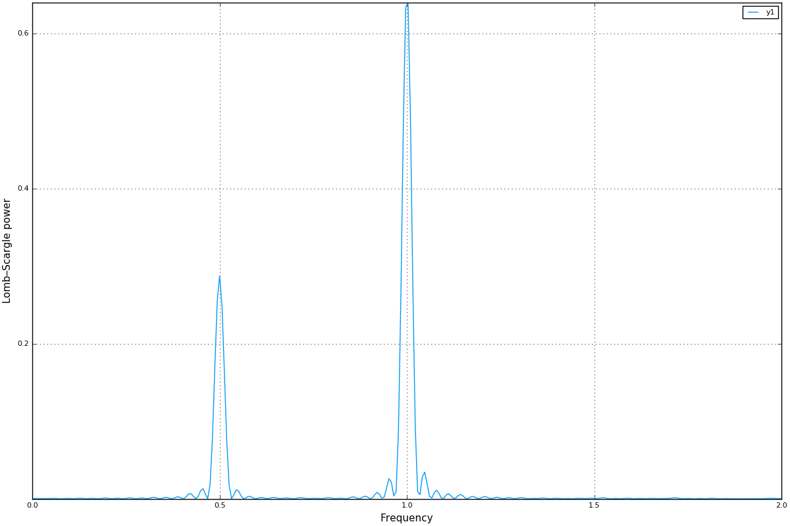
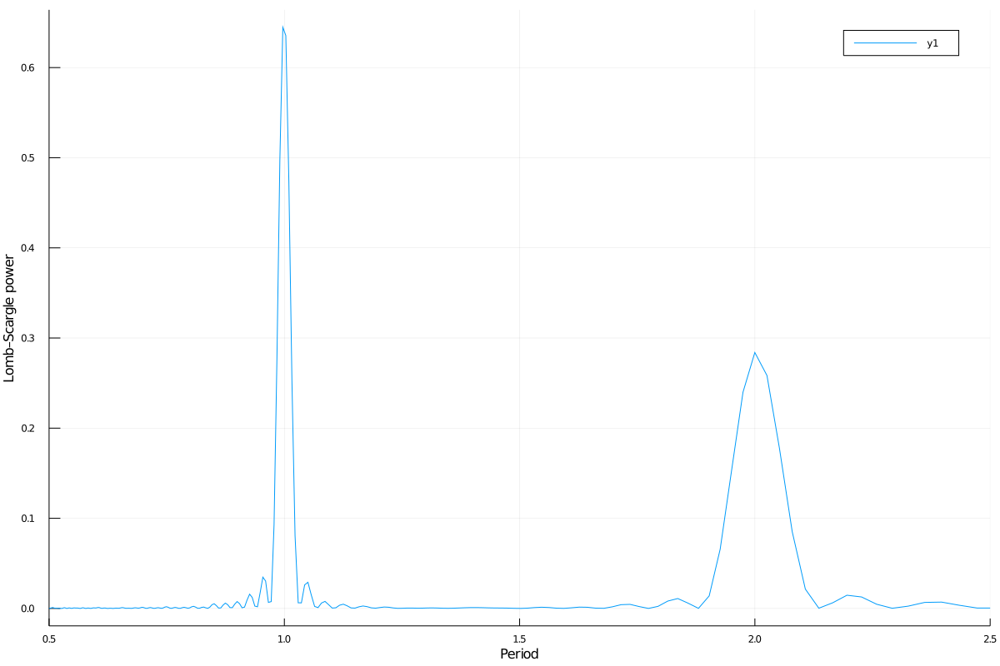
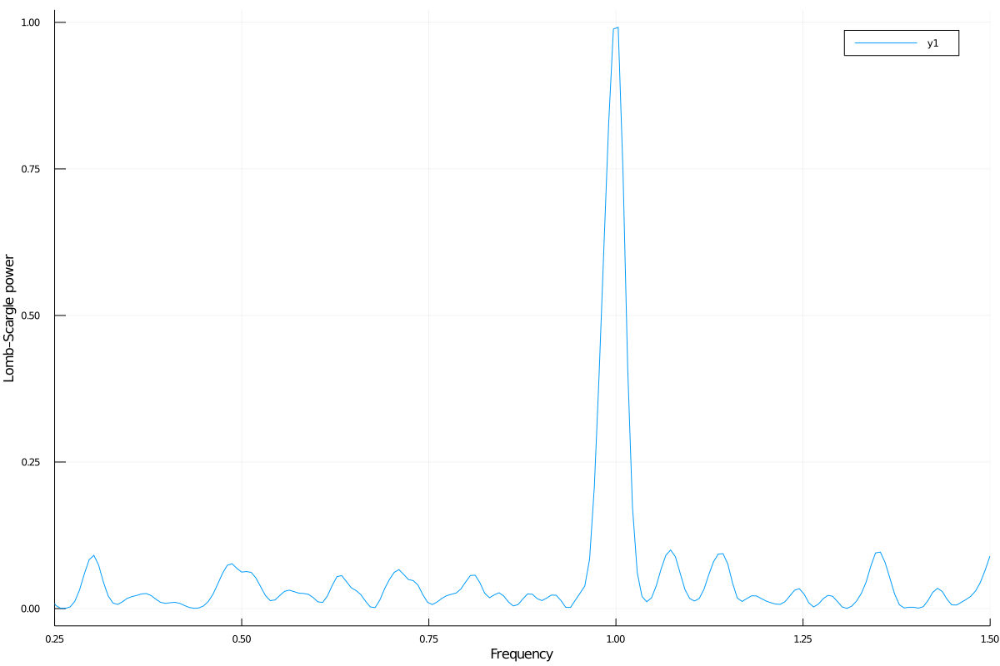
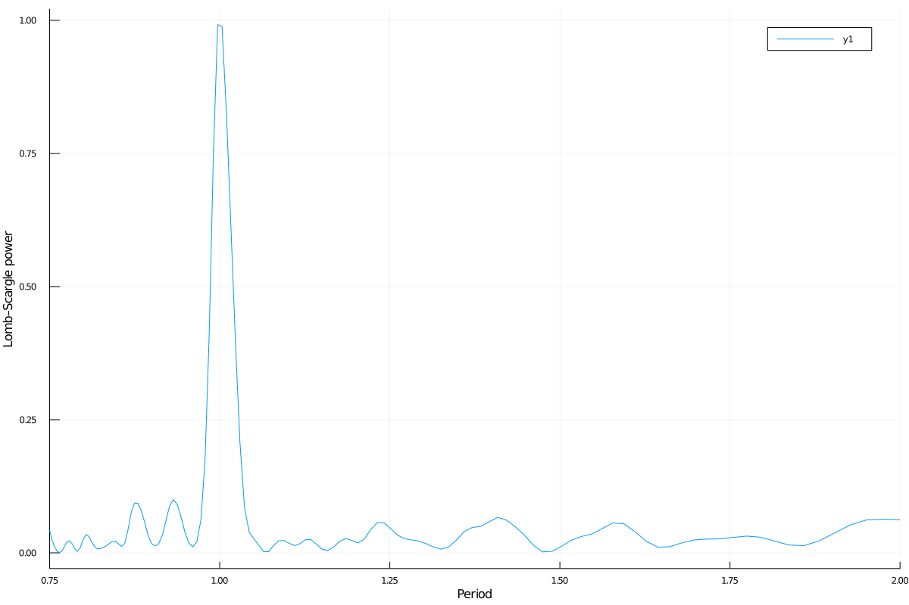
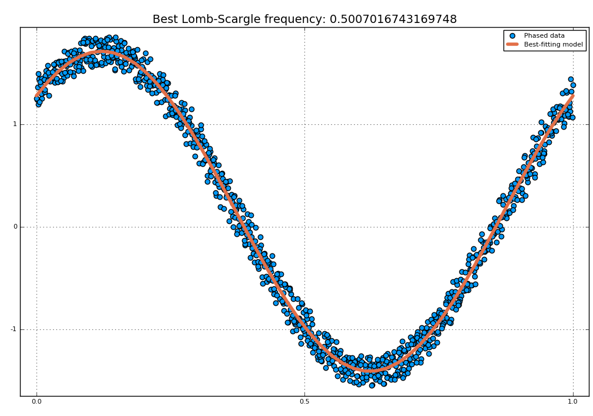
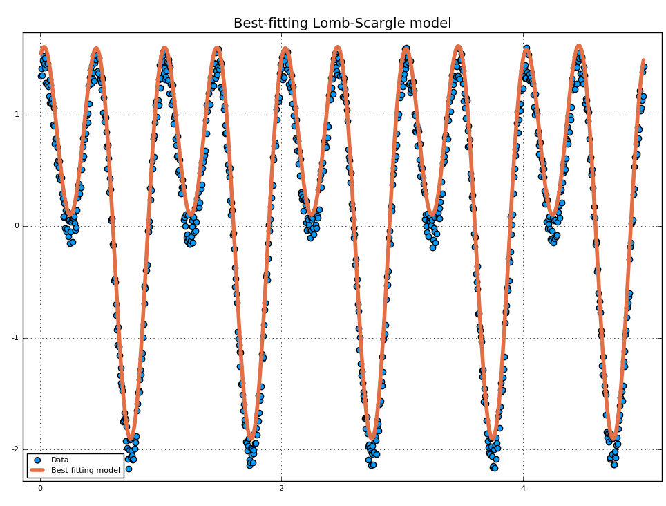
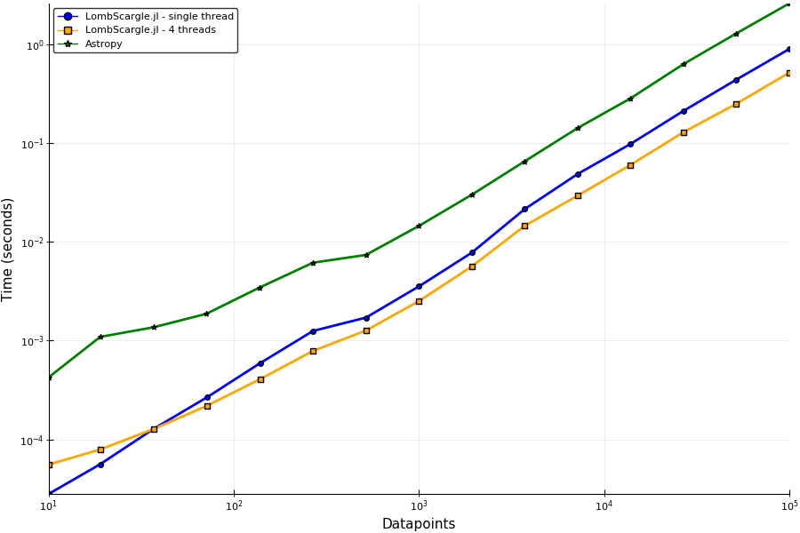

LombScargle.jl
==============

```@meta
DocTestSetup = quote
    using LombScargle
end
```

Introduction
------------

[`LombScargle.jl`](https://github.com/JuliaAstro/LombScargle.jl) is a package for
a fast multi-threaded estimation of the [frequency
spectrum](https://en.wikipedia.org/wiki/Frequency_spectrum) of a periodic signal
with [the Lomb--Scargle
periodogram](https://en.wikipedia.org/wiki/The_Lomb–Scargle_periodogram).  This
is written in [Julia](http://julialang.org/), a modern high-level,
high-performance dynamic programming language designed for technical computing.

Another Julia package that provides tools to perform spectral analysis of
signals is [DSP.jl](https://github.com/JuliaDSP/DSP.jl), but its methods require
that the signal has been sampled at equally spaced times. Instead, the
Lomb--Scargle periodogram enables you to analyze unevenly sampled data as well,
which is a fairly common case in astronomy, a field where this periodogram is
widely used.

The algorithms used in this package are reported in the following papers:

* [PR89] Press, W. H., Rybicki, G. B. 1989, ApJ, 338, 277 (URL:
  <http://dx.doi.org/10.1086/167197>, Bibcode:
  <http://adsabs.harvard.edu/abs/1989ApJ...338..277P>)
* [TOW10] Townsend, R. H. D. 2010, ApJS, 191, 247 (URL:
  <http://dx.doi.org/10.1088/0067-0049/191/2/247>, Bibcode:
  <http://adsabs.harvard.edu/abs/2010ApJS..191..247T>)
* [ZK09] Zechmeister, M., Kürster, M. 2009, A&A, 496, 577 (URL:
  <http://dx.doi.org/10.1051/0004-6361:200811296>, Bibcode:
  <http://adsabs.harvard.edu/abs/2009A%26A...496..577Z>)

Other relevant papers are:

* [CMB99] Cumming, A., Marcy, G. W., & Butler, R. P. 1999, ApJ, 526, 890 (URL:
  <http://dx.doi.org/10.1086/308020>, Bibcode:
  <http://adsabs.harvard.edu/abs/1999ApJ...526..890C>)
* [CUM04] Cumming, A. 2004, MNRAS, 354, 1165 (URL:
  <http://dx.doi.org/10.1111/j.1365-2966.2004.08275.x>, Bibcode:
  <http://adsabs.harvard.edu/abs/2004MNRAS.354.1165C>)
* [HB86] Horne, J. H., & Baliunas, S. L. 1986, ApJ, 302, 757 (URL:
  <http://dx.doi.org/10.1086/164037>, Bibcode:
  <http://adsabs.harvard.edu/abs/1986ApJ...302..757H>)
* [LOM76] Lomb, N. R. 1976, Ap&SS, 39, 447 (URL:
  <http://dx.doi.org/10.1007/BF00648343>, Bibcode:
  <http://adsabs.harvard.edu/abs/1976Ap%26SS..39..447L>)
* [MHC93] Murdoch, K. A., Hearnshaw, J. B., & Clark, M. 1993, ApJ, 413, 349
  (URL: <http://dx.doi.org/10.1086/173003>, Bibcode:
  <http://adsabs.harvard.edu/abs/1993ApJ...413..349M>)
* [SCA82] Scargle, J. D. 1982, ApJ, 263, 835 (URL:
  <http://dx.doi.org/10.1086/160554>, Bibcode:
  <http://adsabs.harvard.edu/abs/1982ApJ...263..835S>)
* [SS10] Sturrock, P. A., & Scargle, J. D. 2010, ApJ, 718, 527 (URL:
  <http://dx.doi.org/10.1088/0004-637X/718/1/527>, Bibcode:
  <http://adsabs.harvard.edu/abs/2010ApJ...718..527S>)

The package provides facilities to:

- compute the periodogram using different methods (with different
  speeds) and different normalizations. This is one of the fastest
  implementations of these methods available as free software. If
  Julia is run with more than one
  [thread](http://docs.julialang.org/en/stable/manual/parallel-computing/#multi-threading-experimental),
  computation is automatically multi-threaded, further speeding up
  calculations;
- access the frequency and period grid of the resulting periodogram,
  together with the power spectrum;
- find the maximum power in the periodogram and the frequency and
  period corresponding to the peak. All these queries can be
  restricted to a specified region, in order to search a local
  maximum, instead of the global one;
- calculate the probability that a peak arises from noise only
  (false-alarm probability) using analytic formulas, in order to
  assess the significance of the peak;
- perform bootstrap resamplings in order to compute the false-alarm
  probability with a statistical method;
- determine the best-fitting Lomb--Scargle model for the given data
  set at the given frequency.

Installation
------------

`LombScargle.jl` is available for Julia 0.7 and later versions, and can
be installed with [Julia's built-in package
manager](http://docs.julialang.org/en/stable/manual/packages/). In a
Julia session run the commands

```julia
julia> using Pkg
julia> Pkg.update()
julia> Pkg.add("LombScargle")
```

Older versions are also available for Julia 0.4-0.6.

Usage
-----

After installing the package, you can start using it with

```julia
using LombScargle
```

The module defines a new `LombScargle.Periodogram` data type, which,
however, is not exported because you will most probably not need to
directly manipulate such objects. This data type holds both the
frequency and the power vectors of the periodogram.

The main function provided by the package is `lombscargle`:

```@docs
lombscargle(::AbstractVector{<:Real}, rest...)
```

`lombscargle` returns a `LombScargle.Periodogram`. The only two mandatory
arguments are:

- `times`: the vector of observation times
- `signal`: the vector of observations associated with `times`

The optional argument is:

- `errors`: the uncertainties associated to each `signal` point.

All these vectors must have the same length.

!!! tip

    You can pre-plan a periodogram with [`LombScargle.plan`](@ref)
    function, which has the same syntax as [`lombscargle`](@ref)
    described in this section. In this way the actual computation of the
    periodogram is faster and you will save memory. See the [Planning the
    Periodogram](#Planning-the-Periodogram-1) section below.

!!! tip

    `LombScargle.jl` exploits Julia's native
    [multi-threading](http://docs.julialang.org/en/stable/manual/parallel-computing/#multi-threading-experimental)
    for the non-fast methods (the methods used when you set the keyword
    `fast=false`). Run Julia with ``n`` threads (e.g., `JULIA_NUM_THREADS=4 julia` for
    4 threads, if your machine has 4 physical cores) in order to automatically gain
    an ``n`` -fold scaling.

    Please note that multi-threading is still an experimental feature in Julia, so
    you may encounter issues when running it with more than one thread. For example,
    bug [#17395](https://github.com/JuliaLang/julia/issues/17395) (if still open)
    may prevent the function, on some systems, from effectively scaling.

If the signal has uncertainties, the `signal` vector can also be a vector of
`Measurement` objects (from
[Measurements.jl](https://github.com/JuliaPhysics/Measurements.jl) package), in
which case you need not to pass a separate `errors` vector for the uncertainties
of the signal. You can create arrays of `Measurement` objects with the
`measurement` function, see `Measurements.jl` manual at
<https://juliaphysics.github.io/Measurements.jl/stable> for more details. The
generalised Lomb--Scargle periodogram by [ZK09] is always used when the signal
has uncertainties, because the original Lomb--Scargle algorithm cannot handle
them.

!!! tip

    The uncertainties are only used in the generalised Lomb--Scargle algorithm to
    build an
    [inverse-variance](https://en.wikipedia.org/wiki/Inverse-variance_weighting)
    weights vector (see [ZK09]), that gives more importance to
    datapoints with lower uncertainties. The case where all measurements have the
    same uncertainty (a condition known as
    [homoskedasticity](https://en.wikipedia.org/wiki/Homoscedasticity)) results in a
    constant weights vector, like if there are no uncertainties at all. If you have
    homoskedastic errors, you do not need to provide them to
    [`lombscargle`](@ref).


### Planning the Periodogram

In a manner similar to planning Fourier transforms with FFTW, it is possible to
speed-up computation of the Lomb--Scargle periodogram by pre-planning it with
[`LombScargle.plan`](@ref) function. It has the same syntax as
[`lombscargle`](@ref), which in the base case is:

```@docs
LombScargle.plan
LombScargle.autofrequency
```

`LombScargle.plan` takes all the same argument as [`lombscargle`](@ref) shown
above and returns a `LombScargle.PeriodogramPlan` object after having
pre-computed certain quantities needed afterwards, and pre-allocated the memory
for the periodogram. It is highly suggested to plan a periodogram before
actually computing it, especially for the fast method. Once you plan a
periodogram, you can pass the `LombScargle.PeriodogramPlan` to
[`lombscargle`](@ref) as the only argument.

```@docs
lombscargle(::LombScargle.PeriodogramPlan)
```

Planning the periodogram has a twofold advantage. First of all, the planning
stage is
[type-unstable](https://docs.julialang.org/en/latest/manual/performance-tips.html),
because the type of the plan depends on the value of input parameters, and not
on their types. Thus, separating the planning (inherently inefficient) from the
actual computation of the periodogram (completely type-stable) makes overall
computation faster than directly calling [`lombscargle`](@ref). Secondly, the
`LombScargle.PeriodogramPlan` bears the time vector, but the quantities that are
pre-computed in planning stage do not actually depend on it. This is
particularly useful if you want to calculate the [False-Alarm Probability](@ref)
via bootstrapping with [`LombScargle.bootstrap`](@ref): the vector time is
randomly shuffled, but pre-computed quantities will remain the same, saving both
time and memory in each iteration. In addition, you ensure that you will use the
same options you used to compute the periodogram.

### Fast Algorithm

When the frequency grid is evenly spaced, you can compute an approximate
generalised Lomb--Scargle periodogram using a fast algorithm proposed by [PR89]
that greatly speeds up calculations, as it scales as ``O[N \log(M)]`` for ``N``
data points and ``M`` frequencies. For comparison, the true Lomb--Scargle
periodogram has complexity ``O[NM]``.  The larger the number of datapoints, the
more accurate the approximation.

!!! note

    This method internally performs a [Fast Fourier
    Transform](https://en.wikipedia.org/wiki/Fast_Fourier_transform) (FFT) to
    compute some quantities, but it is in no way equivalent to conventional Fourier
    periodogram analysis.

    `LombScargle.jl` uses [FFTW](http://fftw.org/) functions to compute the FFT. You
    can speed-up this task by using multi-threading: call `FFTW.set_num_threads(n)`
    to use ``n`` threads. However, please note that the running time will not scale as
    ``n`` because computation of the FFT is only a part of the algorithm.


The only prerequisite in order to be able to employ this fast method is to
provide a `frequencies` vector as an `AbstractRange` object, which ensures that
the frequency grid is perfectly evenly spaced. This is the default, since
`LombScargle.autofrequency` returns an `AbstractRange` object.

!!! tip


    In Julia, an `AbstractRange` object can be constructed for example with the
    [`range`](https://docs.julialang.org/en/latest/base/math/#Base.range) function
    (you specify the start of the range, and optionally the stop, the length and the
    step of the vector) or with the syntax
    [`start:[step:]stop`](https://docs.julialang.org/en/latest/base/math/#Base.::)
    (you specify the start and the end of the range, and optionally the linear
    step).

Since this fast method is accurate only for large datasets, it is enabled by
default only if the number of output frequencies is larger than 200. You can
override the default choice of using this method by setting the `fast` keyword
to `true` or `false`. We recall that in any case, the `frequencies` vector must
be a `Range` in order to use this method.

To summarize, provided that `frequencies` vector is an `AbstractRange` object,
you can use the fast method:

- by default if the length of the output frequency grid is larger than
  200 points
- in any case with the `fast=true` keyword

Setting `fast=false` always ensures you that this method will not be used,
instead `fast=true` actually enables it only if `frequencies` is an
`AbstractRange`.

### Normalization

By default, the periodogram ``p(f)`` is normalized so that it has values in the
range ``0 \leq p(f) \leq 1``, with ``p = 0`` indicating no improvement of the
fit and ``p = 1`` a "perfect" fit (100% reduction of ``\chi^2`` or
``\chi^2 = 0``). This is the normalization suggested by [LOM76] and [ZK09], and
corresponds to the `:standard` normalization in [`lombscargle`](@ref)
function. [ZK09] wrote the formula for the power of the periodogram at frequency
``f`` as

```math
p(f) = \frac{1}{YY}\left[\frac{YC^2_{\tau}}{CC_{\tau}} +
\frac{YS^2_{\tau}}{SS_{\tau}}\right]
```

See the paper for details. The other normalizations for periodograms
``P(f)`` are calculated from this one. In what follows, ``N`` is the number
of observations.

- `:model`:

  ```math
  P(f) = \frac{p(f)}{1 - p(f)}
  ```

- `:log`:

  ```math
  P(f) = -\log(1 - p(f))
  ```

- `:psd`:

  ```math
  P(f) = \frac{W}{2}\left[\frac{YC^2_{\tau}}{CC_{\tau}} +
  \frac{YS^2_{\tau}}{SS_{\tau}}\right] = p(f) \frac{W*YY}{2}
  ```
  
  where W is the sum of the inverse of the individual errors, ``W = \sum \frac{1}{\sigma_{i}}``, as given in [ZK09].
  
- `:Scargle`:

  ```math
  P(f) = \frac{p(f)}{\text{noise level}}
  ```

  This normalization can be used when you know the noise level (expected from
  the a priori known noise variance or population variance), but this isn't
  usually the case. See [SCA82]

- `:HorneBaliunas`:

  ```math
  P(f) = \frac{N - 1}{2} p(f)
  ```

  This is like the `:Scargle` normalization, where the noise has been estimated
  for Gaussian noise to be ``(N - 1)/2``. See [HB86]

- If the data contains a signal or if errors are under- or overestimated or if
  intrinsic variability is present, then ``(N-1)/2`` may not be a good
  uncorrelated estimator for the noise level.  [CMB99] suggested to estimate the
  noise level a posteriori with the residuals of the best fit and normalised the
  periodogram as:

  ```math
  P(f) = \frac{N - 3}{2} \frac{p(f)}{1 - p(f_{\text{best}})}
  ```

  This is the `:Cumming` normalization option

### Access Frequency Grid and Power Spectrum of the Periodogram

[`lombscargle`](@ref) returns a `LombScargle.Periodogram` object, but you most
probably want to use the frequency grid and the power spectrum. You can access
these vectors with `freq` and `power` functions, just like in `DSP.jl`
package. If you want to get the 2-tuple `(freq(p), power(p))` use the
`freqpower` function.

```@docs
power
freq
freqpower
```

### Access Period Grid

The following utilities are the analogs of [`freq`](@ref) and
[`freqpower`](@ref), but relative to the periods instead of the
frequencies. Thus `period(p)` returns the vector of periods in the periodogram,
that is `1./freq(p)`, and `periodpower(p)` gives you the 2-tuple `(period(p),
power(p))`.

```@docs
period
periodpower
```

### `findmaxpower`, `findmaxfreq`, and `findmaxperiod` Functions

Once you compute the periodogram, you usually want to know which are the
frequencies or periods with highest power. To do this, you can use the
[`findmaxfreq`](@ref) and [`findmaxperiod`](@ref) functions.

```@docs
findmaxpower
findmaxfreq
findmaxperiod
```

### False-Alarm Probability

Noise in the data produce fluctuations in the periodogram that will present
several local peaks, but not all of them related to real periodicities. The
significance of the peaks can be tested by calculating the probability that its
power can arise purely from noise.  The higher the value of the power, the lower
will be this probability.

!!! note

    [CMB99] showed that the different normalizations result
    in different probability functions. `LombScargle.jl` can calculate the
    probability (and the false-alarm probability) only for the normalizations
    reported by [ZK09], that are `:standard`, `:Scargle`,
    `:HorneBaliunas`, and `:Cumming`.

The probability ``\text{Prob}(p > p_{0})`` that the periodogram power ``p`` can
exceed the value ``p_{0}`` can be calculated with the [`prob`](@ref) function,
whose first argument is the periodogram and the second one is the ``p_{0}``
value. The function [`probinv`](@ref) is its inverse: it takes the probability
as second argument and returns the corresponding ``p_{0}`` value.

```@docs
prob(::LombScargle.Periodogram, ::Real)
probinv(::LombScargle.Periodogram, ::Real)
LombScargle.M
fap(::LombScargle.Periodogram, ::Real)
fapinv(::LombScargle.Periodogram, ::Real)
```

Here are the probability functions for each normalization supported by
`LombScargle.jl`:

- `:standard` (``p \in [0, 1]``):

  ```math
  \text{Prob}(p > p_{0}) = (1 - p_{0})^{(N - 3)/2}
  ```

- `:Scargle` (``p \in [0, \infty)``):

  ```math
  \text{Prob}(p > p_{0}) = \exp(-p_{0})
  ```

- `:HorneBaliunas` (``p \in [0, (N - 1)/2]``):

  ```math
  \text{Prob}(p > p_{0}) = \left(1 - \frac{2p_{0}}{N - 1}\right)^{(N - 3)/2}
  ```

- `:Cumming` (``p \in [0, \infty)``):

  ```math
  \text{Prob}(p > p_{0}) = \left(1 + \frac{2p_{0}}{N - 3}\right)^{-(N - 3)/2}
  ```

As explained by [SS10], «the term "false-alarm probability denotes the
probability that at least one out of ``M`` independent power values in a
prescribed search band of a power spectrum computed from a white-noise time
series is expected to be as large as or larger than a given
value». `LombScargle.jl` provides the [`fap`](@ref) function to calculate the
false-alarm probability (FAP) of a given power in a periodogram. Its first
argument is the periodogram, the second one is the value ``p_{0}`` of the power
of which you want to calculate the FAP. The function [`fap`](@ref) uses the
formula

```math
\text{FAP} = 1 - (1 - \text{Prob}(p > p_{0}))^M
```

where ``M`` is the number of independent frequencies estimated with ``M = T
\cdot \Delta f``, being ``T`` the duration of the observations and ``\Delta f``
the width of the frequency range in which the periodogram has been calculated
(see [CUM04]). The function [`fapinv`](@ref) is the inverse of [`fap`](@ref): it
takes as second argument the value of the FAP and returns the corresponding
value ``p_{0}`` of the power.

The detection threshold ``p_{0}`` is the periodogram power corresponding to some
(small) value of ``\text{FAP}``, i.e. the value of ``p`` exceeded due to noise
alone in only a small fraction ``\text{FAP}`` of trials. An observed power
larger than ``p_{0}`` indicates that a signal is likely present (see [CUM04]).

!!! warning

    Some authors stressed that this method to calculate the false-alarm probability
    is not completely reliable. A different approach to calculate the false-alarm
    probability is to perform Monte Carlo or bootstrap simulations in order to
    determine how often a certain power level ``p_{0}`` is exceeded just by chance
    (see [CMB99], [CUM04], and [ZK09]). See the [Bootstrapping](@ref) section.

#### Bootstrapping

One of the possible and simplest statistical methods that you can use to measure
the false-alarm probability and its inverse is
[bootstrapping](https://en.wikipedia.org/wiki/Bootstrapping_%28statistics%29)
(see section 4.2.2 of [MHC93]).

!!! note

    We emphasize that you can use this method only if you know your data points are
    [independent and identically
    distributed](https://en.wikipedia.org/wiki/Independent_and_identically_distributed_random_variables),
    and they have [white uncorrelated
    noise](https://en.wikipedia.org/wiki/White_noise).

The recipe of the bootstrap method is very simple to implement:

- repeat the Lomb--Scargle analysis a large number ``N`` of times on the original
  data, but with the signal (and errors, if present) vector randomly
  shuffled. As an alternative, shuffle only the time vector;
- out of all these simulations, store the powers of the highest peaks;
- in order to estimate the false-alarm probability of a given power, count how
  many times the highest peak of the simulations exceeds that power, as a
  fraction of ``N``. If you instead want to find the inverse of the false-alarm
  probability ``\text{prob}``, looks for the ``N\cdot\text{prob}``-th element of the
  highest peaks vector sorted in descending order.

Remember to pass to [`lombscargle`](@ref) function the same options, if any, you
used to compute the Lomb--Scargle periodogram before.

`LombScargle.jl` provides simple methods to perform such analysis. The
[`LombScargle.bootstrap`](@ref) function allows you to create a bootstrap sample
with `N` permutations of the original data.

```@docs
LombScargle.bootstrap
```

The false-alarm probability and its inverse can be calculated with [`fap`](@ref)
and [`fapinv`](@ref) functions respectively.  Their syntax is the same as the
methods introduced above, but with a `LombScargle.Bootstrap` object as first
argument, instead of the `LombScargle.Periodogram` one.

```@docs
fap(::LombScargle.Bootstrap{<:AbstractFloat}, ::Real)
fapinv(::LombScargle.Bootstrap{<:AbstractFloat}, ::Real)
```

### `LombScargle.model` Function

For each frequency ``f`` (and hence for the corresponding angular frequency
``\omega = 2\pi f``) the Lomb--Scargle algorithm looks for the sinusoidal function
of the type

```math
a_f\cos(\omega t) + b_f\sin(\omega t) + c_f
```

that best fits the data. In the original Lomb--Scargle algorithm the offset
``c`` is null (see [LOM76]). In order to find the best-fitting coefficients
``a_f``, ``b_f``, and ``c_f`` for the given frequency ``f``, without actually
performing the periodogram, you can solve the linear system ``\mathbf{A}x =
\mathbf{y}``, where ``\mathbf{A}`` is the matrix

```math
\begin{aligned}
\begin{bmatrix}
  \cos(\omega t) & \sin(\omega t) & 1
\end{bmatrix} =
\begin{bmatrix}
  \cos(\omega t_{1}) & \sin(\omega t_{1}) & 1      \\
  \vdots             & \vdots             & \vdots \\
  \cos(\omega t_{n}) & \sin(\omega t_{n}) & 1
\end{bmatrix}
\end{aligned}
```

``t = [t_1, \dots, t_n]^\text{T}`` is the column vector of observation
times, ``x`` is the column vector with the unknown coefficients

```math
\begin{aligned}
\begin{bmatrix}
  a_f \\
  b_f \\
  c_f
\end{bmatrix}
\end{aligned}
```

and ``\textbf{y}`` is the column vector of the signal. The solution of the matrix
gives the wanted coefficients.

This is what the [`LombScargle.model`](@ref) function does in order to return
the best fitting Lomb--Scargle model for the given signal at the given
frequency.

```@docs
LombScargle.model
```

Examples
--------

Here is an example of a noisy periodic signal (``\sin(\pi t) + 1.5\cos(2\pi t)``)
sampled at unevenly spaced times.

```julia
julia> using LombScargle

julia> ntimes = 1001
1001

julia> t = range(0.01, stop = 10pi, length = ntimes) # Observation times
0.01:0.03140592653589793:31.41592653589793

julia> t += step(t)*rand(ntimes) # Randomize times

julia> s = sinpi.(t) .+ 1.5cospi.(2t) .+ rand(ntimes) # The signal

julia> plan = LombScargle.plan(t, s); # Pre-plan the periodogram

julia> pgram = lombscargle(plan) # Compute the periodogram
LombScargle.Periodogram{Float64,StepRangeLen{Float64,Base.TwicePrecision{Float64},Base.TwicePrecision{Float64}},Array{Float64,1}}([0.000472346, 0.000461633, 0.000440906, 0.000412717, 0.000383552, 0.000355828, 0.000289723, 0.000154585, 3.44734e-5, 5.94437e-7  …  3.15125e-5, 0.000487391, 0.0018939, 0.00367003, 0.00484181, 0.00495189, 0.00453233, 0.00480968, 0.00619657, 0.0074052], 0.003185690706734265:0.00637138141346853:79.72190993602499, [0.0295785, 0.0540516, 0.0780093, 0.122759, 0.15685, 0.192366, 0.206601, 0.252829, 0.265771, 0.315443  …  31.1512, 31.1758, 31.2195, 31.2342, 31.2752, 31.293, 31.3517, 31.3761, 31.4148, 31.4199], :standard)
```

You can plot the result, for example with
[Plots](https://github.com/tbreloff/Plots.jl) package. Use [`freqpower`](@ref)
function to get the frequency grid and the power of the periodogram as a
2-tuple.

```julia
using Plots
plot(freqpower(pgram)...)
```



You can also plot the power vs the period, instead of the frequency, with
[`periodpower`](@ref):

```julia
using Plots
plot(periodpower(pgram)...)
```



!!! warning
    If you do not fit for the mean of the signal (`fit_mean=false` keyword to
    [`lombscargle`](@ref) function) without centering the data (`center_data=false`)
    you can get inaccurate results. For example, spurious peaks at low frequencies
    can appear and the real peaks lose power:

    ```julia
    plot(freqpower(lombscargle(t, s, fit_mean=false, center_data=false))...)
    ```

    


!!! tip

    You can tune the frequency grid with appropriate keywords to
    [`lombscargle`](@ref) function. For example, in order to increase the sampling
    increase `samples_per_peak`, and set `maximum_frequency` to lower values in
    order to narrow the frequency range:

    ```julia
    plot(freqpower(lombscargle(t, s, samples_per_peak=20, maximum_frequency=1.5))...)
    ```

    

    If you simply want to use your own frequency grid, directly set the
    `frequencies` keyword:

    ```julia
    plot(freqpower(lombscargle(t, s, frequencies=0.001:1e-3:1.5))...)
    ```

    


### Signal with Uncertainties

The generalised Lomb--Scargle periodogram is able to handle a signal with
uncertainties, and they will be used as weights in the algorithm.  The
uncertainties can be passed either as the third optional argument `errors` to
[`lombscargle`](@ref) or by providing this function with a `signal` vector of
type `Measurement` (from
[Measurements.jl](https://github.com/JuliaPhysics/Measurements.jl) package).

```julia
using Measurements, Plots
ntimes = 1001
t = range(0.01, stop = 10pi, length = ntimes)
s = sinpi.(2t)
errors = rand(0.1:1e-3:4.0, ntimes)
# Run one of the two following equivalent commands
plot(freqpower(lombscargle(t, s, errors, maximum_frequency=1.5))...)
plot(freqpower(lombscargle(t, measurement(s, errors), maximum_frequency=1.5))...)
```



This is the plot of the power versus the period:

```julia
# Run one of the two following equivalent commands
plot(periodpower(lombscargle(t, s, errors, maximum_frequency=1.5))...)
plot(periodpower(lombscargle(t, measurement(s, errors), maximum_frequency=1.5))...)
```



We recall that the generalised Lomb--Scargle algorithm is used when the
`fit_mean` optional keyword to [`lombscargle`](@ref) is `true` if no error is
provided, instead it is always used if the signal has uncertainties.

### Find Highest Power and Associated Frequencies and Periods

[`findmaxfreq`](@ref) function tells you the frequencies with the highest power
in the periodogram (and you can get the period by taking its inverse):

```jldoctest
julia> t = range(0, stop = 10, length = 1001);

julia> s = sinpi.(t);

julia> plan = LombScargle.plan(t, s); # Plan the periodogram

julia> p = lombscargle(plan);

julia> findmaxperiod(p) # Period with highest power
1-element Array{Float64,1}:
 0.004987779939149084

julia> findmaxfreq(p) # Frequency with the highest power
1-element Array{Float64,1}:
 200.49
```

This peak is at high frequencies, very far from the expected value of the period
of 2. In order to find the real peak, you can either narrow the ranges in order
to exclude higher armonics

```julia
julia> findmaxperiod(p, [1, 10]) # Limit the search to periods in [1, 10]
1-element Array{Float64,1}:
 2.04082

julia> findmaxfreq(p, [0.1, 1]) # Limit the search to frequencies in [0.1, 1]
1-element Array{Float64,1}:
 0.49
```

or pass the `threshold` argument to [`findmaxfreq`](@ref) or
[`findmaxperiod`](@ref). You can use [`findmaxpower`](@ref) to discover the
highest power in the periodogram:

```julia
julia> findmaxpower(p)
0.9958310178312316

julia> findmaxperiod(p, 0.95)
10-element Array{Float64,1}:
 2.04082
 1.96078
 0.0100513
 0.0100492
 0.00995124
 0.00994926
 0.00501278
 0.00501228
 0.00498778
 0.00498728

julia> findmaxfreq(p, 0.95)
10-element Array{Float64,1}:
   0.49
   0.51
  99.49
  99.51
 100.49
 100.51
 199.49
 199.51
 200.49
 200.51
```

The first peak is the real one, the other double peaks appear at higher
armonics.

!!! tip

    Usually, plotting the periodogram can give you a clue of what's going on.


### Significance of the Peaks

The significance of the peaks in the Lomb--Scargle periodogram can be assessed
by measuring the [False-Alarm Probability](#false-alarm-probability). Analytic
expressions of this quantity and its inverse can be obtained with the
[`fap`](@ref) and [`fapinv`](@ref) functions, respectively.

```julia
julia> t = linspace(0.01, 20, samples_per_peak = 10)

julia> s = sinpi.(e.*t).^2 .- cos.(5t).^4

julia> plan = LombScargle.plan(t, s);

julia> p = lombscargle(plan)

# Find the false-alarm probability for the highest peak.
julia> fap(p, 0.3)
0.028198095962262748
```

Thus, a peak with power ``0.3`` has a probability of ``0.028`` that it is due to
noise only. A quantity that is often used is the inverse of the false-alarm
probability as well: what is the minimum power whose false-alarm probability is
lower than the given probability? For example, if you want to know the minimum
power for which the false-alarm probability is at most ``0.01`` you can use:

```julia
julia> fapinv(p, 0.01)
0.3304696923786712
```

As we already noted, analytic expressions of the false-alarm probability and its
inverse may not be reliable if your data does not satisfy specific
assumptions. A better way to calculate this quantity is to use statistical
methods. One of this is bootstrapping. In `LombScargle.jl`, you can use the
function [`LombScargle.bootstrap`](@ref) to create a bootstrap sample and then
you can calculate the false-alarm probability and its inverse using this sample.

!!! tip

    When applying the bootstrap method you should use the same options you used to
    perform the periodogram on your data. Using the same periodogram plan you used
    to compute the periodogram will ensure that you use the same options. However,
    note that the fast method gives approximate results that for some frequencies
    may not be reliable (they can go outside the range ``[0, 1]`` for the standard
    normalization). More robust results can be obtained with the `fast = false`
    option.

```julia
# Create a bootstrap sample with 10000
# resamplings of the original data, re-using the
# same periodogram plan.  The larger the better.
# This may take some minutes.
julia> b = LombScargle.bootstrap(10000, plan)

# Calculate the false-alarm probability of a peak
# with power 0.3 using this bootstrap sample.
julia> fap(b, 0.3)
0.0209

# Calculate the lowest power that has probability
# less than 0.01 in this bootstrap sample.
julia> fapinv(b, 0.01)
0.3268290388848437
```

If you query [`fapinv`](@ref) with a too low probability, the corresponding
power cannot be determined and you will get `NaN` as result.

```julia
julia> fapinv(b, 1e-5)
NaN
```

If you want to find the power corresponding to a false-alarm probability of
``\text{prob} = 10^{-5}``, you have to create a new bootstrap sample with ``N``
resamplings so that ``N\cdot\text{prob}`` can be rounded to an integer larger than
or equal to one (for example ``N = 10^{5}``).

### Find the Best-Fitting Model

The [`LombScargle.model`](@ref) function can help you to test whether a certain
frequency fits well your data.

```julia
using Plots
t = range(0.01, stop = 10pi, length = 1000) # Observation times
s = sinpi.(t) .+ 1.2cospi.(t) .+ 0.3rand(length(t)) # The noisy signal
# Pick-up the best frequency
f = findmaxfreq(lombscargle(t, s, maximum_frequency=10, samples_per_peak=20))[1]
t_fit = range(0, stop = 1, length = 50)
s_fit = LombScargle.model(t, s, f, t_fit/f) # Determine the model
scatter(mod.(t.*f, 1), s, lab="Phased data", title="Best Lomb-Scargle frequency: $f")
plot!(t_fit, s_fit, lab="Best-fitting model", linewidth=4)
```



!!! tip
    If there are more than one dominant frequency you may need to consider more
    models. This task may require some work and patience. Plot the periodogram in
    order to find the best frequencies.

    ```julia
    using Plots
    t = range(0.01, stop = 5, length = 1000) # Observation times
    s = sinpi.(2t) .+ 1.2cospi.(4t) .+ 0.3rand(length(t)) # Noisy signal
    plan = LombScargle.plan(t, s, samples_per_peak=50)
    p = lombscargle(plan)
    # After plotting the periodogram, you discover
    # that it has two prominent peaks around 1 and 2.
    f1 = findmaxfreq(p, [0.8, 1.2])[1] # Get peak frequency around 1
    f2 = findmaxfreq(p, [1.8, 2.2])[1] # Get peak frequency around 2
    fit1 = LombScargle.model(t, s, f1) # Determine the first model
    fit2 = LombScargle.model(t, s, f2) # Determine the second model
    scatter(t, s, lab="Data", title="Best-fitting Lomb-Scargle model")
    plot!(t, fit1 + fit2, lab="Best-fitting model", linewidth=4)
    ```

    


Performance
-----------

A pre-planned periodogram in `LombScargle.jl` computed in single thread mode
with the fast method is more than 2 times faster than the implementation of the
same algorithm provided by AstroPy, and more than 4 times faster if 4 FFTW
threads are used (on machines with at least 4 physical CPUs).

The following plot shows a comparison between the times needed to compute a
periodogram for a signal with N datapoints using `LombScargle.jl`, with 1 or 4
FFTW threads (with `flags = FFTW.MEASURE` for better performance), and the
single-threaded Astropy implementation.  (Julia version: 1.6.0; `LombScargle.jl`
version: 1.0.0; Python version: 3.8.6; Astropy version: 4.1.  CPU: Intel(R)
Core(TM) i7-4870HQ CPU @ 2.50GHz.)



Note that this comparison is unfair, as Astropy doesn’t support pre-planning a
periodogram nor multi-threading, and it pads vectors for FFT to a length which
is a power of 2, while by default `LombScargle.jl` uses length which are
multiples of 2, 3, 5, 7.  A non-planned periodogram in single thread mode in
`LombScargle.jl` is still twice as fast as Astropy.

Development
-----------

The package is developed at
<https://github.com/JuliaAstro/LombScargle.jl>. There you can submit bug
reports, make suggestions, and propose pull requests.

### History

The ChangeLog of the package is available in
[NEWS.md](https://github.com/JuliaAstro/LombScargle.jl/blob/master/NEWS.md) file
in top directory.

License
-------

The `LombScargle.jl` package is licensed under the BSD 3-clause "New" or
"Revised" License. The original author is Mosè Giordano.

### Acknowledgements

This package adapts the implementation in Astropy of the the fast Lomb--Scargle
method by [PR89]. We claim no endorsement nor promotion by the Astropy Team.
